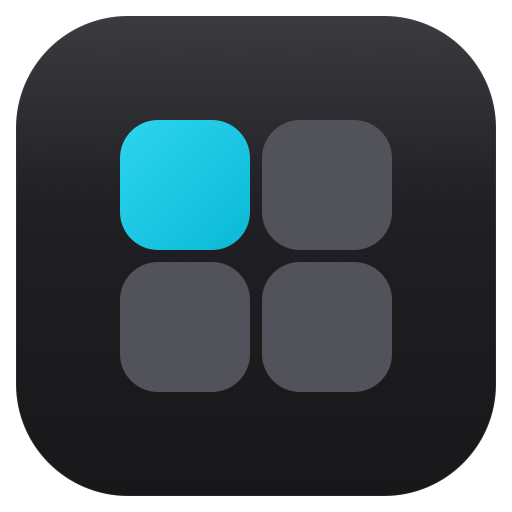
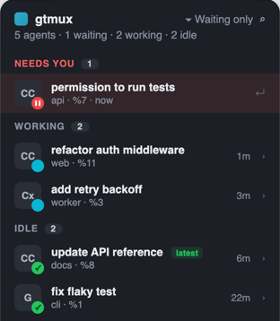
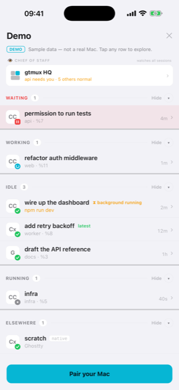

<div align="center">



# gtmux

**See which coding agent needs you across your tmux sessions — jump to the exact pane, reply, and get a push the moment one's blocked. From your terminal, the menu bar, or your phone.**

[](https://github.com/chenchaoyi/gtmux/releases)
[](https://github.com/chenchaoyi/gtmux/actions/workflows/ci.yml)
[](go.mod)
[](LICENSE)

**English** · [中文](README.zh.md)

</div>

---

You run coding agents — Claude Code, Codex, Gemini, aider — inside tmux, often
several at once. They go quiet, and you lose track of which one is waiting on a
yes/no, which is still working, and which just finished.

gtmux is the radar over them. It reads the agents in your tmux, shows who needs
you, and jumps you to the exact pane. When you step away, it tells you the moment
an agent needs a decision — in the menu bar, on the desktop, or on your phone.

It does **not** run your agents. It watches whatever you already have in tmux —
including agents other tools started — and even **senses agents running outside
tmux** (read-only), which `gtmux adopt` can pull into tmux. It never gets in the way.

**Built on tmux — that's the premise.** You run each agent in a tmux pane; gtmux is
the radar and remote over them. Running several agents in tmux — named, one per
pane, persistent across disconnects and reboots — is, we think, the best way to keep
them all in reach, and it's what gtmux's view/jump/reply features are built on.
The setup we recommend: **[Ghostty](https://ghostty.org) + tmux + gtmux** — a fast
native terminal, tmux holding the agents, gtmux to see and reach them from anywhere.
New to tmux? Start with the official
[Getting Started](https://github.com/tmux/tmux/wiki/Getting-Started) guide, or
[`man tmux`](https://man.openbsd.org/tmux) for the full reference.

**One core, five ways in:**

- **CLI** — the base. `gtmux agents` lists every agent (`--watch` is a live dashboard); `focus` jumps, `spawn` dispatches — all inside tmux.
- **Menu-bar app** — an always-visible status dot (red / cyan / green) with a popover and a `⌘⌥G` palette; desktop banners when an agent needs you.
- **iPhone app** — the same radar on iOS: lock-screen push, reply into a pane, Dynamic Island. Remote management — and remote collaboration.
- **Web** — any browser opens your radar and a terminal mirror; guest links you share open here too.
- **Another computer** — `gtmux attach` bridges a tmux session from your Mac into the terminal in front of you.

<div align="center">


</div>

## When you'd use it

- You're running several agents and keep alt-tabbing to check which is blocked.
- You stepped away and want a nudge the moment one needs a yes/no — not ten minutes later.
- You're away from the Mac (home, office, commute) and want to check or unblock an agent from your phone.
- Your Mac rebooted and you want your tmux sessions and tabs back in one command.

## At a glance — `gtmux agents`

```
gtmux agents — 6 agents · 1 waiting · 1 working · 4 idle

⏸ waiting  Claude Code  api:0.0     permission to run tests     %7
⠿ working  Claude Code  web:0.0     refactor auth middleware    %11
✳ idle     Claude Code  worker:0.0  add retry backoff     %8  ✓ latest
✳ idle     Codex        docs:0.0    —                     %1

jump: gtmux focus %7
```

Each row is **status · agent · location · task · pane id**, sorted by urgency:

- **⏸ waiting** — blocked on **you** mid-task (a permission/approval). Sorts to the top.
- **⠿ working** — busy; leave it alone.
- **✳ idle** — finished its turn; your move when ready.

Agents running **outside tmux** (say a bare `codex` in a terminal) are sensed too —
listed read-only under **Elsewhere**, and `gtmux adopt <id>` pulls one into tmux.

Detection is by event *timing*, not keyword guessing, and works with any agent
that animates a spinner — not just Claude Code.


### The supervisor — `gtmux digest` + `gtmux hq`

`gtmux digest` upgrades the glance from STATUS to MEANING: per agent, its
**goal** (last prompt), **last** reply tail, and — when waiting — exactly what
it's **asking**, all assembled deterministically from the transcript (zero LLM
tokens). `gtmux hq` then opens the **supervisor (中控)**: your coding agent in a
dedicated session that reads the digest, watches the fleet, drives panes on your
behalf (`gtmux send`), and gets nudged the moment any agent starts waiting — so
you converse with ONE agent about all the others.

The supervisor can be **any CLI agent**, not just Claude: the playbook is seeded
as `AGENTS.md` (the cross-agent convention Codex/Cursor/Amp read natively) with
`CLAUDE.md` as an `@AGENTS.md` import — pick yours with `gtmux hq --agent codex`
(or `GTMUX_HQ_AGENT`). Edit `~/.config/gtmux/hq/AGENTS.md` to change its policy;
notes it keeps there persist across its sessions. See [docs/cli.md](docs/cli.md).

## Quickstart

**1. Install** — the script gets you the CLI *and* the menu-bar app in one shot
(the app delivers the desktop "waiting on you" notifications, so you want both):

```sh
curl -fsSL https://raw.githubusercontent.com/chenchaoyi/gtmux/main/install.sh | bash
```

Prefer Homebrew? `brew install chenchaoyi/tap/gtmux` (CLI) and
`brew install --cask chenchaoyi/tap/gtmux-app` (menu-bar app).

**2. Set up** — one command checks everything and configures the rest, explaining
and asking before each change:

```sh
gtmux doctor                 # health check — then it offers to fix what's missing:
                             # the agent hook, set-titles (focus/restore need it),
                             # restore-after-reboot, the app
```

**3. Use it — mostly you don't have to.** Once set up, gtmux is passive:

- The **menu-bar dot** is always there (red / cyan / green) — a glance tells you if
  anyone needs you, without switching windows.
- You get a **desktop notification** the moment an agent needs a decision — click it
  to jump straight to that pane (or reply from your phone).
- Press **`⌘⌥G`** anytime to summon the palette and jump to whoever's waiting.

The CLI and in-tmux bindings are there when you want them, but they're extra:

```sh
gtmux agents --watch         # a live dashboard in the terminal; Enter jumps to a pane
gtmux app                    # launch the menu-bar app (alias: menubar)
gtmux update                 # self-update the CLI + menu-bar app (the app also
                             # offers one-click "check for updates")
```

> Just want notifications and nothing else? `gtmux install-hooks` registers only
> the agent hook — but `gtmux doctor` is the recommended path (it does that
> **and** the set-titles focus/restore depend on). For non-Claude agents, add
> `--agent codex|cursor|gemini|copilot|kiro` (Codex wires via its own hooks system,
> coexisting with any existing `notify`).

To watch from your phone, run `gtmux serve` (same Wi-Fi) or `gtmux tunnel`
(anywhere) and pair the iOS app. **Anywhere** comes in two flavors: **Standard**
(zero-config, free) and **Direct** — through gtmux's own server over 443, for
networks that block Cloudflare's edge; a paid unlock via
`gtmux tunnel --redeem <code>`. See **[docs/phone.md](docs/phone.md)**.

> **Requires** macOS + [Ghostty](https://ghostty.org) 1.3+ **or** iTerm2 for the
> jump features (`focus` / `restore` / `new`); `agents` / `overview` work under
> any terminal that hosts tmux. Mainland China / unstable GitHub: see the
> [install notes](docs/install.md).

## Docs

- **[CLI & commands](docs/cli.md)** — `agents` / `overview` / `focus` / `restore` / `new` / `adopt` / `app` / `update`, detection, the notification hook (Claude + `--agent`), tmux key bindings, and permissions.
- **[Mobile & remote access](docs/phone.md)** — the iOS app, `gtmux serve`, and reaching your Mac from anywhere: Standard vs Direct tunnels (and Tailscale), the always-on toggle, and the browser mirror.
- **[Install notes](docs/install.md)** — pinning a version, building from source, and the China / mirror fallback.
- **Design specs** — `docs/design/` (menu-bar `DESIGN.md`, mobile `MOBILE.md`) and `openspec/` for in-flight changes.

## How it's different

Tools like claude-squad, uzi, and dmux *spawn* agents and sandbox them in git
worktrees. gtmux is the opposite: it runs nothing, owns nothing, and is just a
radar plus a remote over the tmux you already use. One static, cgo-free Go
binary; the menu-bar and mobile apps are pure consumers of the same `gtmux agents
--json`. The "g" is for Go.

## License

[MIT](LICENSE) © ccy
