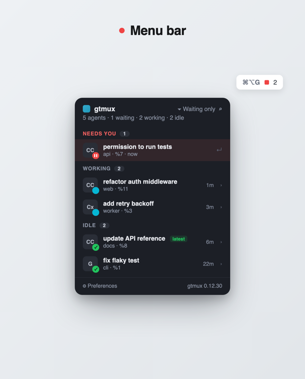
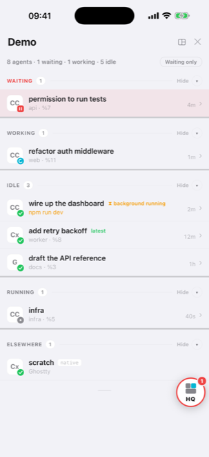

<div align="center">


# gtmux

See which coding agent needs you across your tmux sessions, jump to the exact pane, reply, and get a push the moment one is blocked. From your terminal, the menu bar, or your phone.

[](https://github.com/chenchaoyi/gtmux/releases)
[](https://github.com/chenchaoyi/gtmux/actions/workflows/ci.yml)
[](go.mod)
[](LICENSE)

**English** · [中文](README.zh.md)

</div>

---

You run coding agents (Claude Code, Codex, Gemini, Cursor) inside tmux, often
several at once. When they go quiet, you lose track of which one is waiting on a
yes/no, which is still working, and which just finished.

gtmux is a radar over them. It reads the agents in your tmux, shows who needs
you, and jumps you to the exact pane. When you step away, it tells you the moment
an agent needs a decision: in the menu bar, on the desktop, or on your phone.

gtmux does not start or run your agents. It watches whatever is already in your
tmux, including agents another tool started, and it also senses agents running
outside tmux (read-only; `gtmux adopt` can pull one into tmux).

gtmux assumes tmux. You run each agent in its own tmux pane, and gtmux is the
radar and remote over those panes. We think running several agents this way
(named, one per pane, surviving disconnects and reboots) is the best way to keep
them all in reach, and the view, jump and reply features are built on it. The
setup we recommend is [Ghostty](https://ghostty.org) + tmux + gtmux: a fast
native terminal, tmux holding the agents, gtmux to see and reach them from
anywhere. New to tmux? Start with the official
[Getting Started](https://github.com/tmux/tmux/wiki/Getting-Started) guide, or
[`man tmux`](https://man.openbsd.org/tmux) for the full reference.

One core, five ways in:

- CLI, the base. `gtmux agents` lists every agent (`--watch` is a live dashboard); `focus` jumps to a pane and `spawn` dispatches a task, all inside tmux.
- Menu-bar app. An always-visible status dot (red means an agent is waiting for you, cyan means working, green means idle), a popover, a `⌘⌥G` palette, and desktop banners when an agent needs you.
- iPhone app ([App Store](https://apps.apple.com/app/id6791144062)). The same radar on iOS: lock-screen push, replies typed into a pane, Dynamic Island. Manage your own agents from your phone, or hand one session to a collaborator with a scoped link.
- Web. Any browser opens your radar and a terminal mirror; guest links you share open here too.
- Another computer. `gtmux attach` bridges a tmux session from your Mac into the terminal in front of you.

Every remote path above needs the Mac awake. Close the lid and it sleeps, taking
the tunnel and every agent's turn with it. `gtmux awake` keeps the Mac and the
tunnel running with the lid shut: one admin authorization, a pulsing dot in the
menu bar for as long as it lasts, and no password to turn it off. It works on
battery too, and gives sleep back on its own at 20%.

<div align="center">


</div>

## When you'd use it

- You're running several agents and keep alt-tabbing to check which is blocked.
- You stepped away and want a nudge within seconds of an agent needing a yes/no.
- You're away from the Mac (home, office, commute) and want to check or unblock an agent from your phone.
- Your Mac rebooted and you want your tmux sessions and tabs back in one command.

## At a glance: `gtmux agents`

```
gtmux agents — 6 agents · 1 waiting · 1 working · 4 idle

⏸ waiting  Claude Code  api:0.0     permission to run tests     %7
⠿ working  Claude Code  web:0.0     refactor auth middleware    %11
✳ idle     Claude Code  worker:0.0  add retry backoff     %8  ✓ latest
✳ idle     Codex        docs:0.0    —                     %1

jump: gtmux focus %7
```

Each row is status, agent, location, task and pane id, sorted by urgency:

- `⏸ waiting`: blocked on you mid-task (a permission or an approval). Sorts to the top.
- `⠿ working`: busy; leave it alone.
- `✳ idle`: finished its turn; your move when you are ready.

The apps colour the same states: red for waiting, cyan for working, green for
idle, and grey for a plain process that is running (no agent state to report).

Agents running outside tmux (say a bare `codex` in a terminal) are sensed too.
They are listed read-only under Elsewhere, and `gtmux adopt <id>` pulls one into
tmux.

How detection works: inside tmux, an agent that has gtmux's hook installed (a
small callback the agent runs at the start and end of each turn) reports its
state directly, and an agent without the hook is still recognised from what is
on its screen. An agent running outside tmux is seen only if it has the hook.


### HQ, the supervisor: `gtmux digest` + `gtmux hq`

`gtmux digest` tells you what each agent is doing, beyond its status: its goal
(the last prompt you gave it), the tail of its last reply, and, when it is
waiting, exactly what it is asking. The table is assembled from what gtmux
already has, so it costs no model calls.

`gtmux hq` opens HQ (the supervisor, 中控): one coding agent in its own session
that reads the fleet digest, watches the other agents, types into their panes
for you, and is woken the moment one of them starts waiting. You talk to HQ
instead of to each agent.

Any CLI agent can be HQ; pick one with `gtmux hq --agent codex` (or
`GTMUX_HQ_AGENT`). Its instructions are generated in your language
(`GTMUX_LANG`, English or Chinese) and upgraded along with gtmux. Your own
preferences (priorities, reporting style, quiet hours) live in
`~/.config/gtmux/hq/LOCAL.md`, a file gtmux never overwrites. `gtmux capture`
saves a lesson to HQ's knowledge base. See [docs/cli.md](docs/cli.md).

## Quickstart

### 1. Install

The script installs the CLI and the menu-bar app together (the app delivers the
desktop "waiting on you" notifications, so you want both):

```sh
curl -fsSL https://raw.githubusercontent.com/chenchaoyi/gtmux/main/install.sh | bash
```

Prefer Homebrew? `brew install chenchaoyi/tap/gtmux` (CLI) and
`brew install --cask chenchaoyi/tap/gtmux-app` (menu-bar app).

### 2. Set up

One command checks everything and configures the rest, explaining and asking
before each change:

```sh
gtmux doctor                 # health check — then it offers to fix what's missing:
                             # the agent hook, set-titles (focus/restore need it),
                             # restore-after-reboot, the app
```

### 3. Use it

Mostly you don't have to. Once set up, gtmux is passive:

- The menu-bar dot is always there (red for waiting on you, cyan for working, green for idle, grey for a plain running process, no agent state). A glance tells you if anyone needs you, without switching windows.
- You get a desktop notification the moment an agent needs a decision. Click it to jump straight to that pane, or reply from your phone.
- Press `⌘⌥G` anytime to open the palette and jump to whoever is waiting.

The CLI and in-tmux bindings are there when you want them, but they are extra:

```sh
gtmux agents --watch         # a live dashboard in the terminal; Enter jumps to a pane
gtmux app                    # launch the menu-bar app (alias: menubar)
gtmux update                 # self-update the CLI + menu-bar app (the app also
                             # offers one-click "check for updates")
```

> Just want notifications and nothing else? `gtmux install hooks` registers only
> the agent hook. `gtmux doctor` is still the recommended path: it does that and
> also configures the set-titles that focus and restore depend on. For agents
> other than Claude, add `--agent codex|cursor|gemini|copilot|kiro|opencode|kimi`
> (Codex is wired through its own hooks system and coexists with any existing
> `notify`; opencode installs a small plugin; Kimi Code gets one marked block
> appended to your own `config.toml`).

To watch from your phone, run `gtmux serve` (same Wi-Fi) or `gtmux tunnel`
(from anywhere, no VPN needed, and the path we recommend), then pair the iOS
app. Tailscale or any other VPN works as an alternative. `gtmux tunnel` comes
in two flavors: Standard (zero-config, free) and Direct, which goes through
gtmux's own server over port 443 for networks that block Cloudflare's edge.
See [docs/phone.md](docs/phone.md).

> **Requires** macOS plus [Ghostty](https://ghostty.org) 1.3+ or iTerm2 for the
> jump features (`focus` / `restore` / `new`). Warp works too, best-effort: exact
> tab focus only for tabs gtmux opened, otherwise it activates the app.
> `agents` / `overview` work under any terminal that hosts tmux. Mainland China
> or unstable GitHub: see the [install notes](docs/install.md).

## Docs

- [CLI & commands](docs/cli.md): the radar (`agents`, `panes`), HQ (`digest`, `hq`, `capture`, `knowledge`), verified dispatch (`spawn`, `send`, `tasks`, `reap`), budget and machine (`usage`, `limits`, `resource`, `awake`), reaching a session (`focus`, `restore`, `new`, `adopt`, `attach`, `pair`, `share`), plus how detection works, the notification hook (Claude + `--agent`), tmux key bindings, and permissions.
- [Mobile & remote access](docs/phone.md): the iOS app, `gtmux serve`, and reaching your Mac from anywhere: Standard vs Direct tunnels (and Tailscale), the always-on toggle, and the browser mirror.
- [Install notes](docs/install.md): pinning a version, building from source, and the China / mirror fallback.
- Design specs: `docs/design/` (menu-bar `DESIGN.md`, mobile `MOBILE.md`) and `openspec/` for in-flight changes.

## Repo map

| Path | What it is |
|---|---|
| `cmd/gtmux` + `internal/` | the Go CLI core (cgo-free): radar, HQ, dispatch, `serve` |
| `macapp/` | native macOS menu-bar app (Swift/AppKit), a pure consumer of `gtmux agents --json` |
| `mobileapp/` | the iOS app (bare React Native), the third surface |
| `relay-worker/` | the **deployed push relay** (Cloudflare Worker behind `gtmux-relay.ccy.dev`) |
| `relay/` | Go **self-host reference implementation** of the push relay, not the deployed one |
| `tunnel-worker/` | the **deployed hosted-tunnel provisioner** (Cloudflare Worker behind `api.gtmux.ccy.dev`) |
| `deploy/self-tunnel/` | self-host tunnel-server configs + docs (Caddy, chisel) |
| `api/contract.md` | the v0 HTTP/SSE contract between `gtmux serve` and the apps |
| `assets/agent-icons/` | built-in agent identity icons, embedded in the binary (sources in `SOURCES.md`) |
| `docs/` | user docs (`cli.md`, `phone.md`, `install.md`) + the design authority in `docs/design/` |
| `openspec/` | capability specs (what IS built) + in-flight change proposals |
| `scripts/` | CI conformance gate (`check-design.sh`) |
| `install.sh` | the curl installer |

## How it's different

Tools like claude-squad, uzi, and dmux are launchers: they start agents,
sandbox them in git worktrees, and show you the agents they started. gtmux
reads the tmux you already have, so it sees agents you started by hand, agents
another tool started, and (read-only) agents running outside tmux. It can
dispatch too (`gtmux spawn`, worktrees included), but dispatch is optional, and
nothing you already run has to move for gtmux to see it. gtmux is one static,
cgo-free Go binary (the "g" in the name is for Go); the menu-bar and mobile apps
are consumers of the same `gtmux agents --json`.

## License

[MIT](LICENSE) © ccy
