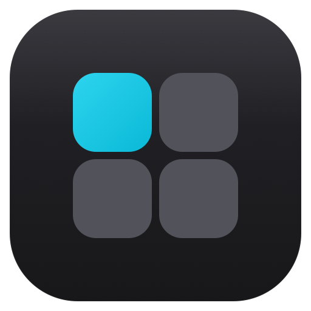
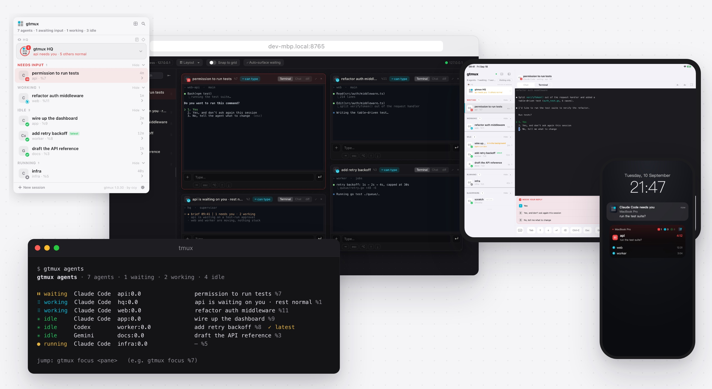
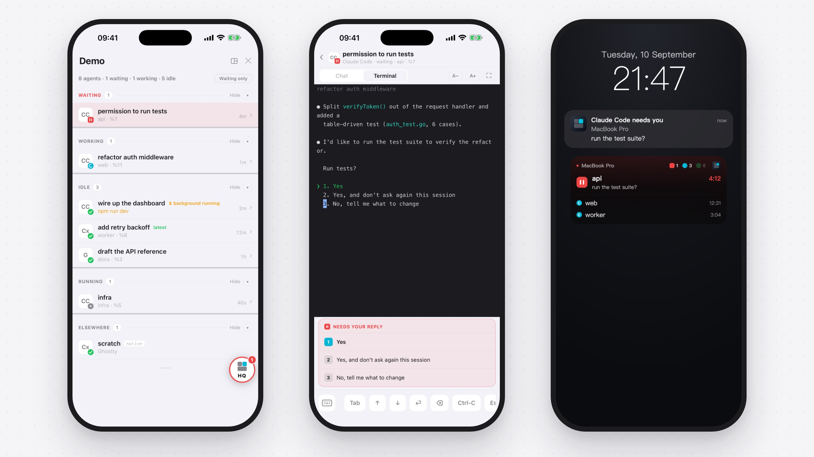

<div align="center">



# gtmux

See which coding agent in your tmux sessions needs you, jump to its pane, reply, and get notified when one is blocked, from the terminal, the menu bar or your phone.

[](https://github.com/chenchaoyi/gtmux/releases)
[](https://github.com/chenchaoyi/gtmux/actions/workflows/ci.yml)
[](go.mod)
[](LICENSE)

**English** · [中文](README.zh.md)

</div>

<picture>
  <source media="(prefers-color-scheme: dark)" srcset="docs/assets/readme-hero-dark.jpg" />
  
</picture>

If you run several coding agents (Claude Code, Codex, Gemini, Cursor) in tmux, it gets
hard to tell which one is waiting on a yes/no, which is still working and which has
finished. gtmux is a radar and a remote for those panes, and it sees the agents already
in your tmux no matter who started them.

gtmux assumes each agent runs in its own tmux pane. We recommend
[Ghostty](https://ghostty.org) + tmux + gtmux, and if tmux is new to you, start with its
[Getting Started](https://github.com/tmux/tmux/wiki/Getting-Started) guide.

## Five ways in

- In the terminal, `gtmux agents` lists every agent, `focus` jumps to a pane and `spawn` hands an agent a task.
- The menu-bar app keeps a status dot in view, opens a `⌘⌥G` palette and posts a desktop notification when an agent needs you.
- The iPhone and iPad app ([App Store](https://apps.apple.com/app/id6791144062)) adds lock-screen push and replies typed into a pane, and can hand one session to a collaborator through a scoped link.
- The web mirror opens your radar and a terminal view in any browser, for you or for a guest you shared a link with.
- From another computer, `gtmux attach` brings a tmux session from your Mac into the local terminal.

Every remote path needs the Mac awake, and `gtmux awake` keeps the Mac and its tunnel
running with the lid closed after one admin authorization, letting it sleep again when the
battery reaches 20%.

## The radar

```
gtmux agents — 4 agents · 1 waiting · 1 working · 2 idle

⏸ waiting  Claude Code  api:0.0     permission to run tests     %7
⠿ working  Claude Code  web:0.0     refactor auth middleware    %11
✳ idle     Claude Code  worker:0.0  add retry backoff     %8  ✓ latest
✳ idle     Codex        docs:0.0    —                     %1

jump: gtmux focus %7
```

Rows are sorted by urgency. The apps use the same states in colour: red is waiting for
you, cyan is working, green is idle, and grey is a plain running process with no agent
state to report.

Agents with the gtmux hook (a small callback the agent runs at the start and end of each
turn) report their state directly. Inside tmux, an agent without the hook is recognised
from its screen. Outside tmux, gtmux sees an agent only through the hook and lists it
read-only; `gtmux adopt <id>` moves it into tmux.

## HQ, the supervisor

`gtmux digest` shows what each agent is working on: your last prompt, the end of its
last reply, and what it's asking when it waits. It makes no model calls. `gtmux hq`
starts HQ, an agent in its own session that reads that digest, watches the others, types
into their panes for you and is woken when one starts waiting, so you can talk to HQ
instead of to each agent.

## What it looks like

<picture>
  <source media="(prefers-color-scheme: dark)" srcset="docs/assets/readme-screens-dark.jpg" />
  
</picture>

## Quickstart

The install script sets up the CLI and the menu-bar app, which delivers the desktop
notifications.

```sh
curl -fsSL https://raw.githubusercontent.com/chenchaoyi/gtmux/main/install.sh | bash
```

With Homebrew, use `brew install chenchaoyi/tap/gtmux` for the CLI and
`brew install --cask chenchaoyi/tap/gtmux-app` for the menu-bar app.

Then run the health check. It offers to set up what's missing (the agent hook, the
set-titles option that focus and restore need, restore after reboot, the app) and asks
before each change.

```sh
gtmux doctor
```

After that you can mostly leave it alone. The menu-bar dot shows whether anyone needs
you, a notification takes you to the pane, and `⌘⌥G` jumps to whoever is waiting. The
CLI is there when you want it:

```sh
gtmux agents --watch         # live dashboard in the terminal; Enter jumps to a pane
gtmux app                    # launch the menu-bar app (alias: menubar)
gtmux update                 # update the CLI and the menu-bar app
```

If you only want notifications, `gtmux install hooks` registers just the agent hook (add
`--agent codex|cursor|gemini|copilot|kiro|opencode|kimi` for agents other than Claude Code).

To use your phone, run `gtmux serve` on the same Wi-Fi or `gtmux tunnel` from anywhere
(no VPN needed), then pair the iOS app. See [docs/phone.md](docs/phone.md).

Jumping to a pane (`focus`, `restore`, `new`) needs macOS with
[Ghostty](https://ghostty.org) 1.3+ or iTerm2, or Warp on a best-effort basis. `agents`
and `overview` work in any terminal that hosts tmux. From mainland China, or with
unreliable GitHub access, see the [install notes](docs/install.md).

## How it's different

Tools like claude-squad, uzi and dmux start agents in git worktrees and show you the ones
they started. gtmux reads the tmux you already have, so it also sees agents you started by
hand or with another tool, and it can still dispatch work with `gtmux spawn`.
It's a single cgo-free Go binary, and the apps read the same `gtmux agents --json`.

## Docs

- [CLI and commands](docs/cli.md): every command, HQ, detection, per-agent hooks, tmux key bindings.
- [Phone and remote access](docs/phone.md): the iOS app, `gtmux serve`, the tunnels, the browser mirror.
- [Install notes](docs/install.md): pinning a version, building from source, mirrors.
- [Design docs](docs/design/README.md), with in-flight changes in `openspec/`.

The repo map and contributor notes are in [CONTRIBUTING.md](CONTRIBUTING.md).

## License

[MIT](LICENSE) © ccy
