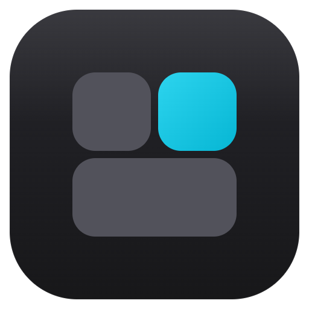
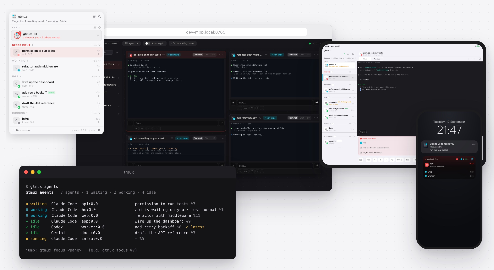
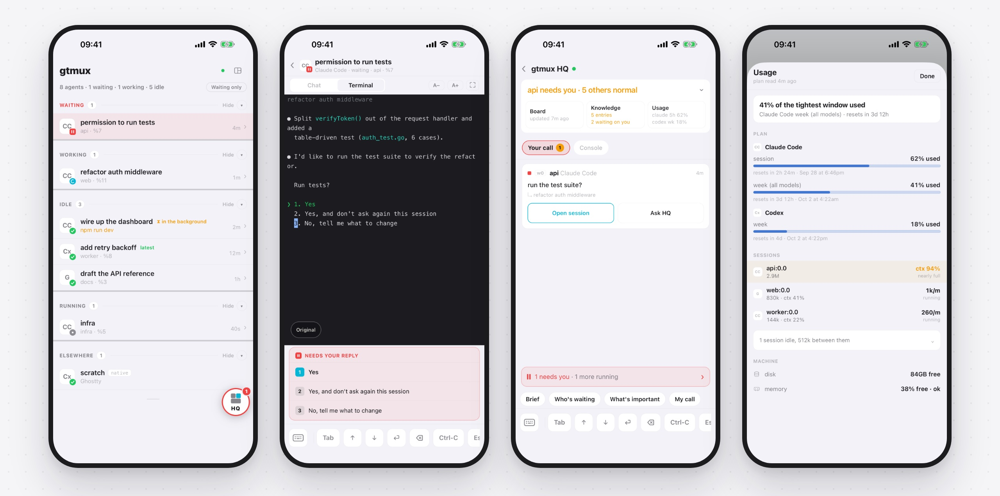

<div align="center">



# gtmux

Command center for your tmux sessions and the agents in them.

[](https://github.com/chenchaoyi/gtmux/releases)
[](https://github.com/chenchaoyi/gtmux/actions/workflows/ci.yml)
[](go.mod)
[](LICENSE)

**English** · [中文](README.zh.md)

</div>

<picture>
  <source media="(prefers-color-scheme: dark)" srcset="docs/assets/readme-hero-dark.jpg" />
  
</picture>

If you run several coding agents (Claude Code, Codex, Gemini, Cursor) in tmux, it gets
hard to tell which one is waiting on a yes/no, which is still working and which has
finished. gtmux is a radar and a remote for those panes, and it sees the agents already
in your tmux no matter who started them.

gtmux assumes each agent runs in its own tmux pane. We recommend
[Ghostty](https://ghostty.org) + tmux + gtmux, and if tmux is new to you, start with its
[Getting Started](https://github.com/tmux/tmux/wiki/Getting-Started) guide.

## Five ways in

- In the terminal, `gtmux agents` lists every agent, `focus` jumps to a pane and `spawn` hands an agent a task.
- The menu-bar app keeps a status dot in view, opens a `⌘⌥G` palette, posts a desktop notification when an agent needs you, and with `⌥⌘4` takes a screenshot you can mark up and send to an agent.
- The iPhone and iPad app ([App Store](https://apps.apple.com/app/id6791144062)) adds lock-screen push and replies typed into a pane, and can hand a collaborator chosen panes through a scoped link.
- The web view opens your radar and panes in any browser. You can type where your device or a guest link has permission.
- From another computer, `gtmux attach` brings a tmux session from your Mac into the local terminal.

Every remote path needs the Mac awake. `gtmux awake on` keeps it running with the lid
closed after one admin authorization, so an already configured serve and tunnel can
keep answering. On battery, it warns at 30% and restores sleep at 20%; it does not
start remote access for you. A bare `gtmux awake` reports the current state.

## The radar

```
gtmux agents · 7 agents · 1 waiting · 2 working · 3 idle · 1 running

‖ waiting  Claude Code  api:0.0                permission to run tests %7
⠿ working  Claude Code  hq:0.0                 api is waiting on you · rest normal %1
⠿ working  Claude Code  web:0.0                refactor auth middleware %11
✓ idle     Claude Code  app:0.0                wire up the dashboard %9
✓ idle     Codex        worker:0.0             add retry backoff %8  latest
✓ idle     Gemini       docs:0.0               draft the API reference %3
● running  Claude Code  infra:0.0              — %5

jump: gtmux focus <pane>   (e.g. gtmux focus %7)
```

Rows are sorted by urgency. The apps use the same states in colour: red is waiting for
you, cyan is working, green is idle, and grey is an identified agent process whose turn state is not known.

Agents with the gtmux hook (a small callback the agent runs at the start and end of each
turn) report their state directly. Inside tmux, gtmux recognises agents from their
command, title and process tree; screen and CPU sampling can supply state when no
hook reports it. Outside tmux, gtmux sees an agent only through the hook and lists it
read-only. `gtmux adopt <id>` can resume an idle, resumable conversation with saved
messages in tmux; ChatGPT desktop conversations cannot be adopted.

## HQ, the supervisor

`gtmux digest` shows what each agent is working on: your last prompt, the end of its
last reply, and what it's asking when it waits. It makes no model calls. `gtmux hq`
starts HQ in its own agent session. HQ reads the digest and events, coordinates other
agents and is woken when one starts waiting. You can give HQ instructions for work
across several sessions and review the actions it takes.

## What it looks like

<picture>
  <source media="(prefers-color-scheme: dark)" srcset="docs/assets/readme-screens-dark.jpg" />
  
</picture>

## Quickstart

The install script sets up the CLI and the menu-bar app, which delivers the desktop
notifications.

```sh
curl -fsSL https://raw.githubusercontent.com/chenchaoyi/gtmux/main/install.sh | bash
```

With Homebrew, use `brew install chenchaoyi/tap/gtmux` for the CLI and
`brew install --cask chenchaoyi/tap/gtmux-app` for the menu-bar app.

Then run the health check. It offers to set up what's missing (the agent hook, the
set-titles option that focus and restore need, restore after reboot, the app) and asks
before each change.

```sh
gtmux doctor
```

After that you can mostly leave it alone. The menu-bar dot shows whether anyone needs
you, a notification takes you to the pane, and `⌘⌥G` jumps to whoever is waiting. The
CLI is there when you want it:

```sh
gtmux agents --watch         # live dashboard in the terminal; Enter jumps to a pane
gtmux app                    # launch the menu-bar app (alias: menubar)
gtmux update                 # update the CLI and the menu-bar app
```

With the menu-bar app installed and running, `gtmux install hooks` registers the agent hook for notifications (add
`--agent codex|cursor|gemini|copilot|kiro|opencode|kimi` for agents other than Claude Code).

To use your phone, run `gtmux serve` on a reachable local network, or `gtmux tunnel`
for an HTTPS address reachable from other networks without a VPN, then pair the iOS
app. The networks still need to permit that connection. See [docs/phone.md](docs/phone.md).

Jumping to a pane (`focus`, `restore`, `new`) needs macOS with
[Ghostty](https://ghostty.org) 1.3+, iTerm2, or cmux; Warp works on a best-effort basis. `agents`
and `overview` work in any terminal that hosts tmux. From mainland China, or with
unreliable GitHub access, see the [install notes](docs/install.md).

## How it's different

Tools like claude-squad, uzi and dmux start agents in git worktrees and show you the ones
they started. gtmux reads the tmux you already have, so it also sees agents you started by
hand or with another tool, and it can still dispatch work with `gtmux spawn`.
It's a single cgo-free Go binary, and the apps read the same `gtmux agents --json`.

## Guides

Walkthroughs with screenshots, one task each:

- [Watch a fleet of agents](docs/guides/watch-a-fleet.md): run agents in tmux, read the radar, jump to the one waiting.
- [Let HQ watch the fleet for you](docs/guides/hq-supervisor.md): start the supervisor, what wakes it, when it decides, dispatch, knowledge, moving it to another Mac.
- [Use your phone, iPad and browser](docs/guides/phone-and-web.md): pair your own devices, reply to agents and share selected panes.
- [Attach to your Mac from any computer](docs/guides/attach-from-anywhere.md): a real terminal into a session on your Mac.

## Docs

- [CLI and commands](docs/cli.md): every command, HQ, detection, per-agent hooks, tmux key bindings.
- [Remote access reference](docs/phone.md): connection methods, permissions, notifications and troubleshooting.
- [What HQ remembers](docs/knowledge.md): the knowledge base, the three layers, and what you can change.
- [Install notes](docs/install.md): pinning a version, building from source, mirrors.
- [Design docs](docs/design/README.md), with in-flight changes in `openspec/`.

The repo map and contributor notes are in [CONTRIBUTING.md](CONTRIBUTING.md).

## License

[MIT](LICENSE) © ccy
