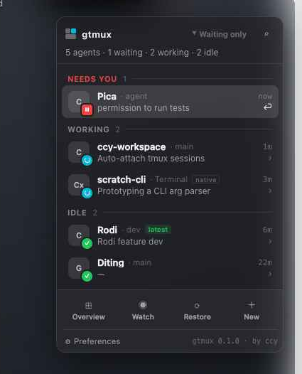

<div align="center">


# gtmux

**tmux 会话与 coding agent 的指挥中心。**

[](https://github.com/chenchaoyi/gtmux/releases)
[](https://github.com/chenchaoyi/gtmux/actions/workflows/ci.yml)
[](go.mod)
[](https://ghostty.org)
[](LICENSE)

[English](README.md) · **中文**



</div>

---

`gtmux` 架在你已经在用的 tmux 会话、以及会话里运行的 coding agent（Claude
Code、Codex、Gemini、aider…）之上。一眼看清谁在**等你**、谁在**运行**、谁已**空闲**，
再一键跳到那个 agent 所在的终端标签页和 tmux pane。

一个核心、两副面孔：终端里的轻量 **Go CLI**，和常驻可见的 **macOS 菜单栏 app**。

### 它有何不同

和那些**孵化** agent、把 agent 放进 git worktree 沙盒里的工具（claude-squad、uzi、
dmux…）不同，gtmux **不运行你的 agent** —— 它是**你已有 tmux 之上的雷达 + 遥控器**。
无侵入、tmux 原生，连*别的*工具孵化出来的 agent 也能照见（它们也在 tmux 里）。
名字里的 “g” 取自 Go。

### 适用范围

gtmux **聚焦在 tmux + agent 的工作模式**：它追踪**在 tmux 里运行**的 coding agent。
**直接在终端 tab 里（不经 tmux）启动的 agent 不会被检测到** —— 这是有意的聚焦，不是 bug。
支持原生、非 tmux 终端是未来可能的方向；当前请把 agent 跑在 tmux 里才能看到。

### 亮点

- 🛰️ **一眼看尽所有 agent** —— `⏸ 等待 · ⠿ 运行 · ✳ 空闲`，按紧急度排序。
- 🎯 **一键直达** —— 精确落到需要你的那个 Ghostty 标签页**与** tmux pane。
- 🔔 **知道何时该你出手** —— 内置 hook 凭事件*时序*而非关键词猜测，区分「权限请求」与「空闲提醒」。
- 🍫 **菜单栏 app** —— 原生的常驻状态点（红/青/绿），带弹层与 ⌘⌥G 命令面板。
- 🧩 **不挑 agent** —— 凡是会转加载动画的 agent 都能识别；一个 JSON 文件即可扩展。
- 🪶 **无侵入、零 cgo** —— 只读 tmux，从不接管你的 agent；单个静态 Go 二进制。

> **要求** macOS + [Ghostty](https://ghostty.org) 1.3+。`restore`/`focus` 通过
> AppleScript 驱动 Ghostty；`agents`/`overview` 在任何 tmux 上都能用。

## 安装

```sh
curl -fsSL https://raw.githubusercontent.com/chenchaoyi/gtmux/main/install.sh | bash
```

把校验过 checksum 的二进制装到 `~/.local/bin/gtmux`，并安装菜单栏 app
（`GTMUX_NO_APP=1` 跳过 · `GTMUX_APP_LOGIN=1` 开机自启）。用 `GTMUX_VERSION=vX.Y.Z`
锁定版本。从源码安装：`go install github.com/chenchaoyi/gtmux/cmd/gtmux@latest`。

<details>
<summary>中国大陆 / GitHub 不稳定 —— 镜像回退</summary>

安装脚本**优先走 GitHub，下载卡住时自动回退到镜像链**
（`ghfast.top` → `gh-proxy.com` → `ghproxy.net`）。`SHASUMS256.txt` 始终先从
GitHub 直取，因此即便压缩包走了镜像，用于校验的 checksum 仍锚定在 GitHub。可用
`GTMUX_INSTALL_MIRROR` 覆盖：

```sh
GTMUX_INSTALL_MIRROR=ghproxy  curl -fsSL https://raw.githubusercontent.com/chenchaoyi/gtmux/main/install.sh | bash   # 直接走镜像链
GTMUX_INSTALL_MIRROR=https://my.mirror/  curl -fsSL ... | bash   # 自定义 <前缀><github-url> 代理
GTMUX_INSTALL_MIRROR=github   curl -fsSL ... | bash   # 只用 GitHub，不走镜像
```

</details>

## 一眼概览 —— `gtmux agents`

```
gtmux agents — 6 agents · 1 waiting · 1 working · 4 idle

⏸ waiting  Claude Code  Pica:0.0          permission to run tests   %7
⠿ working  Claude Code  ccy-workspace:0.0 Auto-attach tmux sessions %11
✳ idle     Claude Code  Rodi:0.0          Rodi feature dev   %8  ✓ latest
✳ idle     Claude Code  Diting:0.0        —                  %1

jump: gtmux focus <pane>   (e.g. gtmux focus %11)
```

一处看清谁在运行、谁已空闲、谁刚完成。每行是 **状态 · agent · 位置 · 任务 · pane id**，
按紧急度排序。三种状态：

- **⠿ 运行** —— 忙着（别打扰）。
- **⏸ 等待** —— 任务中途卡在**你**这儿等权限/确认；排到最顶，一眼看到谁要你拍板。
- **✳ 空闲** —— 本轮已答完，准备好了再轮到你（不紧急）。

**`gtmux agents --watch`** 是实时自动刷新的看板（基于
[bubbletea](https://github.com/charmbracelet/bubbletea)）：约 1.5s 轮询，**↑/↓**
选择，**Enter** 跳到对应 pane，**r** 刷新，**q** 退出。**`--json`** 输出同样的数据，
供脚本和菜单栏 app 消费。

<details>
<summary>识别原理（不只认 Claude）</summary>

- **状态**取自 agent 自己写的 pane 标题：开头的盲文加载符（`⠋⠙⠹…`，多数 agent TUI
  会转的那个）= **运行中**；Claude Code 的 `✳` = **空闲**。会转加载符的 agent 都通用。
- **是哪个 agent**：按前台命令（`claude`、`codex`、`gemini`、`aider`、`opencode`…）
  或标题里的名字匹配。
- 用 **`~/.config/gtmux/agents.json`** 扩展/覆盖 —— 一个
  `{"name","commands","idleGlyph"}` 的 JSON 数组，你的条目优先于内置。
- 只有 agent **进程确实在跑**的 pane 才会列出。一个普通 shell 上残留的旧 agent 标题
  （比如 resurrect 恢复但没重启 agent 的会话）**不计入**。

`⏸ 等待` 和 `✓ latest` 来自[通知 hook](#通知-hook) 写的状态文件。没有它时 agent
永远不会显示 `⏸`，其余功能照常。

</details>

## 菜单栏 app

<div align="center">

&nbsp;&nbsp;

</div>

你在 coding agent 之上的常驻雷达 —— 原生 macOS `LSUIElement` 状态项（Swift /
AppKit）。状态点用颜色概括最紧急的状态 —— **红**=等待 · **青**=运行 · **绿**=空闲 ·
无任务时灰色 —— 并带计数角标（如两个 agent 需要你时显示 `2`）。

- **点状态点，或按 ⌘⌥G**，打开弹层 / 命令面板。
- agent 按 **需要你 → 运行中 → 空闲** 分组；每行是 `‹字形› 会话 · 任务`。
- **点一行**（或 `⏎` / `⌘1–9`）即运行 `gtmux focus <pane>` 跳过去。
- 底部有 **概览**、**实时**、**接回已分离**、**新建会话** 快捷入口。

它是 CLI 的纯**消费方** —— 轮询 `gtmux agents --json`、外壳调用 `gtmux focus`，
因此 gtmux-core 始终是唯一数据源。CLI 保持零 cgo，app 是唯一的原生构建。Release 附带
通用、ad-hoc 签名的 `Gtmux-<version>-macos.zip`，安装脚本会清掉隔离标记，首次启动
不被拦。用 `gtmux uninstall-app` 卸载。

## 命令

| 命令 | 作用 |
| --- | --- |
| `agents [--watch\|--json]` | 各 pane 里的 coding agent：谁在等待/运行/空闲、在哪、跳过去用哪个 pane id |
| `overview [--popup]` | 会话 / 窗口 / pane 概览；`--popup` 适配 tmux 弹窗 |
| `restore [--pick\|--one\|<name>\|--dry-run]` | 每会话一个 Ghostty 标签页，全部 attach |
| `focus <name\|pane-id>` | 跳到某会话的标签页；pane id（`%N`）精确落到那个 pane |
| `new [name]` | 在新 Ghostty 标签页里开一个 tmux 会话 |

直接 `gtmux` 打印帮助；`gtmux --version` 打印版本。输出语言跟随 `--lang=en|zh`
（默认 `en`）或 `$GTMUX_LANG`。显式调用 —— 无 shell hook，任何 shell 都能用。

### `gtmux restore`

退出 Ghostty 后，tmux 服务和所有会话都还活着 —— 没的只是标签页。重开 Ghostty 后，
在任意标签页里**跑一次**：

```sh
gtmux restore            # 每个 tmux 会话一个 Ghostty 标签页，全部 attach
gtmux restore --pick     # 选会话："1 3" / "1,3"，Enter = 全部，q = 取消
gtmux restore --one      # 在当前标签页 attach 下一个未挂的会话
gtmux restore <name>     # 在这里 attach 指定会话
gtmux restore --dry-run  # 只打印将发生什么，不改动
```

首次运行会弹出自动化权限对话框（“想要控制 Ghostty”）—— 点允许。**重启之后** tmux
服务本身也没了；`gtmux restore` 仍可用：它会启动 tmux 并**显式驱动
[tmux-resurrect](https://github.com/tmux-plugins/tmux-resurrect) 恢复上次自动存档**
（会一直等到恢复完成 —— 大布局要 30 秒以上；若存档存在却恢复失败，会拒绝覆盖它）。
运行中的程序不会被重启 —— 比如用 `claude --resume` 重新拉起。

**每个 pane 之前的输出（scrollback）也会一起回来** —— 像快照一样 —— 前提是让 resurrect
抓取它。`tmux.conf` 推荐：

```tmux
set -g @resurrect-capture-pane-contents 'on'   # 快照每个 pane 的 scrollback
set -g history-limit 50000                     # 保留/恢复多少滚动缓冲
```

> shell 的 **↑ 命令历史** 是另一回事 —— 它在 shell 的 histfile 里，不归 resurrect 管。
> 默认只在 shell 退出时写盘，所以重启会丢最近的命令。要即时落盘（bash）：在 `~/.bashrc` 加
> `shopt -s histappend; PROMPT_COMMAND='history -a'`（zsh 是 `setopt INC_APPEND_HISTORY`）。
> 恢复回来的 scrollback 里**能看到**之前的命令；这一步只是让它们还能用 ↑ 调出来。

### `gtmux overview`

```
gtmux overview — 2 sessions · 3 windows · 5 panes

▶ ccy-workspace        1 window · 1 pane
    0: ccy-workspace *  (1 pane)
● Pica                 2 windows · 4 panes
    0: editor  (1 pane)
    1: claude *  (3 panes)

▶ current  ● attached  ○ detached   * active  Z zoomed  • new output
```

任意 shell 下的会话/窗口/pane 概览。**`--popup`** 适配 tmux `display-popup` 的尺寸，
可绑到一个按键，浮在全屏程序之上而不打断它。

### `gtmux focus`

```sh
gtmux focus Pica         # 把显示会话 "Pica" 的 Ghostty 标签页带到最前
gtmux focus %11          # 跳到那个确切的 window+pane，再聚焦它的标签页
```

因为每个标签页标题是 `会话 — 窗口`，`focus` 找到匹配标签页并运行 Ghostty 的
AppleScript `select tab` + `activate`。pane id（`%N`）还会先在会话内 `select-window`
+ `select-pane`，让你落到确切的 pane —— 通知点击之所以能把你带到刚完成的那个 agent，
正是靠这个。

> 需要 `set-titles on` 配 `set-titles-string '#S — #W'`，让标签页标题保持 `focus`
> 匹配的格式。若有别的工具也写标签页标题，请关掉它，让标题保持权威。

## tmux 集成

gtmux 只是个 CLI —— 在 `tmux.conf` 里随你绑键。推荐：

```tmux
set -g set-titles on
set -g set-titles-string '#S — #W'
bind g run-shell -b "gtmux overview --popup"
bind a display-popup -E -w 80% -h 60% "gtmux agents --watch --popup"
bind J run-shell "gtmux focus --last"
```

## 通知 hook

`⏸ 等待`、`✓ latest`、以及点击即跳的通知，都依赖一个 hook 往
`~/.local/share/gtmux/` 写状态文件。gtmux 把这个 hook **内置**了 —— 无需外部脚本：

```sh
gtmux install-hooks          # 一次性配置（macOS）
gtmux uninstall-hooks        # 撤销
```

`install-hooks` 把 `gtmux hook` 注册到 `~/.claude/settings.json` 的 `Stop`、
`Notification`、`UserPromptSubmit` 事件（幂等；保留其它 hook 并先备份）。`gtmux hook`
是生产端 —— Claude Code 来跑，不用你跑 —— 纯凭事件**时序**写状态，不读消息内容就能区分
权限请求与空闲提醒。

**通知由菜单栏 app 原生发送** —— 不再需要 `terminal-notifier`。hook 把请求排进
`~/.local/share/gtmux/notify/`，由 `Gtmux.app` 弹出原生横幅（显示为 **Gtmux**，带
agent 图标、**Jump** 动作，并区分文案 —— *已完成* 安静无声，*需要你的输入* 有提示音），
点击即精确跳到那个 pane。首次运行请允许「通知」权限；保持 app 运行即可收到。

## 权限

gtmux 只申请它真正需要的：

- **自动化（控制 Ghostty）** —— `focus` / `restore` / `new` 以及点击通知跳转都要用。
  第一次用 AppleScript 驱动 Ghostty 时 macOS 会弹窗，点**允许**。
- **通知** —— 让菜单栏 app 弹 agent 横幅。首次运行允许即可。
- **开机自启**（可选）—— 仅当你在偏好设置里打开时。

它**不需要**下面这些 —— 如果 macOS 弹了，可以放心**拒绝**，不影响功能：

- **App 管理（"修改你 Mac 上的 app"）** —— gtmux 从不修改其它 app；它的代码只会动它**自己**的
  bundle（更新/卸载时）。你看到这个弹窗，是 macOS 通过「责任进程链」把*别的* app 的自更新
  （比如浏览器在更新自己）算到了 gtmux 常驻后台进程头上。拒绝对 gtmux 毫无影响。
- **文件与文件夹（下载/桌面/文稿）** —— gtmux 不读这些。弹窗通常出现在 `restore` 把某个
  原工作目录在这些文件夹里的 tmux 会话恢复回去时 —— 那是 gtmux 调起的 `tmux` 在打开该目录。
  可放心拒绝；只影响那一个会话的目录。

> macOS 把已授的权限绑定到 app 的代码签名上。**Developer ID 签名 + 公证**的构建能让授权在更新后
> 保留；**ad-hoc** 构建（本地 `make app`、或未签名的 release）每次构建身份都变，macOS 会忘掉、
> 重新问。构建时设 `GTMUX_SIGN_ID` 即可用你的 Developer ID 签名（见 `macapp/build.sh`）。

## 许可

[MIT](LICENSE) © ccy
