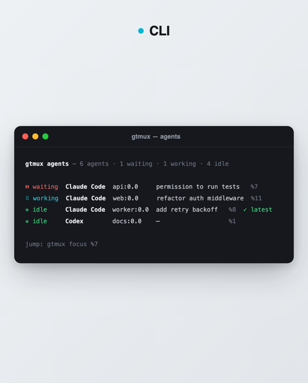

<div align="center">


# gtmux

**一眼看清哪个 coding agent 在等你 —— 跨所有 tmux 会话,跳到对应 pane、直接回复,有人卡住立刻收到推送。终端、菜单栏、手机,随处可用。**

[](https://github.com/chenchaoyi/gtmux/releases)
[](https://github.com/chenchaoyi/gtmux/actions/workflows/ci.yml)
[](go.mod)
[](LICENSE)

[English](README.md) · **中文**

</div>

---

你在 tmux 里跑着 coding agent（Claude Code、Codex、Gemini、aider），常常好几个一起。
它们一安静下来，你就分不清哪个在等你拍板、哪个还在跑、哪个刚跑完。

gtmux 就是盯着它们的那台雷达。它读出你 tmux 里的 agent，告诉你谁需要你，并把你直接送到
那个 pane。你离开座位时，它会在 agent 需要你做决定的那一刻提醒你 —— 菜单栏、桌面，或手机。

它**不运行**你的 agent，只盯着你 tmux 里已有的（包括别的工具起的 agent），从不挡你的路。

**以 tmux 为前提 —— 这是它的根基。** 你把每个 agent 跑在一个 tmux pane 里，gtmux 就是这些
agent 之上的雷达和遥控。用 tmux 管理多个 agent（各自命名、一 pane 一个、断连和重启都不丢）
在我们看来是最好的方式，gtmux 的查看/跳转/回复能力都建立在它之上。**我们推荐的组合：
[Ghostty](https://ghostty.org) + tmux + gtmux** —— 一个快的原生终端、tmux 托住 agent、gtmux
随处查看与触达它们。

**一个核心，三块屏：**

- **CLI**：`gtmux agents` 列出每个 agent 和跳转位置；`--watch` 是实时看板。
- **菜单栏 app**：常驻可见的状态点（红 / 青 / 绿），带弹层和 `⌘⌥G` 命令面板。
- **移动端 app**：同一套雷达搬到 iOS，agent 需要你时锁屏推送，点一下就能回复。

<div align="center">



</div>

## 什么时候用得上

- 你同时跑好几个 agent，老得来回切窗口看哪个卡住了。
- 你离开了座位，想在某个 agent 要你拍板的那一刻就收到提醒，而不是十分钟后。
- 你不在 Mac 旁边（在家、在公司、在路上），想用手机看一眼或把卡住的 agent 推进一下。
- Mac 重启了，你想一条命令把 tmux 会话和标签页都恢复回来。

## 一眼概览 —— `gtmux agents`

```
gtmux agents — 6 agents · 1 waiting · 1 working · 4 idle

⏸ waiting  Claude Code  api:0.0     permission to run tests     %7
⠿ working  Claude Code  web:0.0     refactor auth middleware    %11
✳ idle     Claude Code  worker:0.0  add retry backoff     %8  ✓ latest
✳ idle     Codex        docs:0.0    —                     %1

jump: gtmux focus %7
```

每行是**状态 · agent · 位置 · 任务 · pane id**，按紧急度排序：

- **⏸ waiting**：任务中途卡在**你**身上（要权限/批准），排到最前。
- **⠿ working**：正忙，别打扰。
- **✳ idle**：这一轮跑完了，你想接手时再说。

判定靠的是事件**时序**而不是猜关键词，凡是会转加载动画的 agent 都能识别，不止 Claude Code。

## 快速上手

```sh
curl -fsSL https://raw.githubusercontent.com/chenchaoyi/gtmux/main/install.sh | bash
```

把 CLI 装到 `~/.local/bin/gtmux`，并装上菜单栏 app。然后：

```sh
gtmux install-hooks          # 让 agent 能上报「在等你」（一次性）
gtmux agents --watch         # 实时看板；回车跳到对应 pane
```

想用手机看，跑 `gtmux serve`（同一网络）或 `gtmux tunnel`（任意网络），再配对 iOS app。
见 **[docs/phone.md](docs/phone.md)**。

> **需要** macOS + [Ghostty](https://ghostty.org) 1.3+ **或** iTerm2 才能用跳转功能
> （`focus` / `restore` / `new`）；`agents` / `overview` 在任何承载 tmux 的终端下都能用。
> 中国大陆 / GitHub 不稳：见 [安装说明](docs/install.md)。

## 文档

- **[CLI 与命令](docs/cli.md)**：`agents` / `overview` / `focus` / `restore` / `new`、识别原理、通知 hook、tmux 按键绑定、权限。
- **[移动端与远程访问](docs/phone.md)**：iOS app、`gtmux serve`，以及用 Tailscale 或 `gtmux tunnel` 从任意网络连回 Mac。
- **[安装说明](docs/install.md)**：锁版本、从源码装、中国大陆 / 镜像兜底。
- **设计规范**：`docs/design/`（菜单栏 `DESIGN.md`、移动端 `MOBILE.md`），在途变更看 `openspec/`。

## 它有何不同

claude-squad、uzi、dmux 这类工具**孵化** agent、把它们放进 git worktree 沙盒。gtmux 正相反：
什么都不跑、什么都不占，只是你已有 tmux 之上的一台雷达加一个遥控器。一个静态、零 cgo 的 Go
二进制；菜单栏和移动端 app 都只是同一份 `gtmux agents --json` 的消费方。名字里的 “g” 取自 Go。

## 许可

[MIT](LICENSE) © ccy
