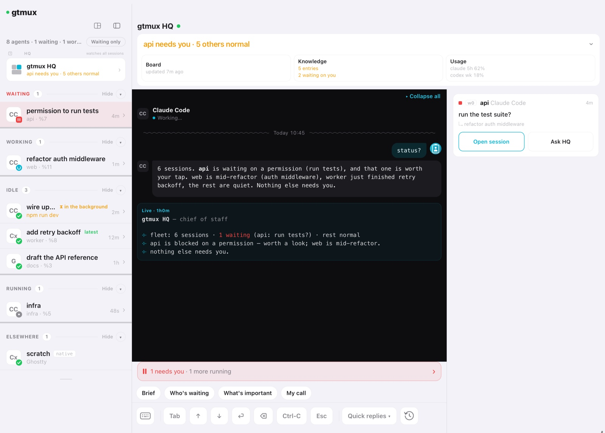
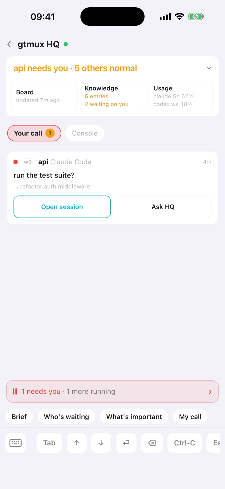
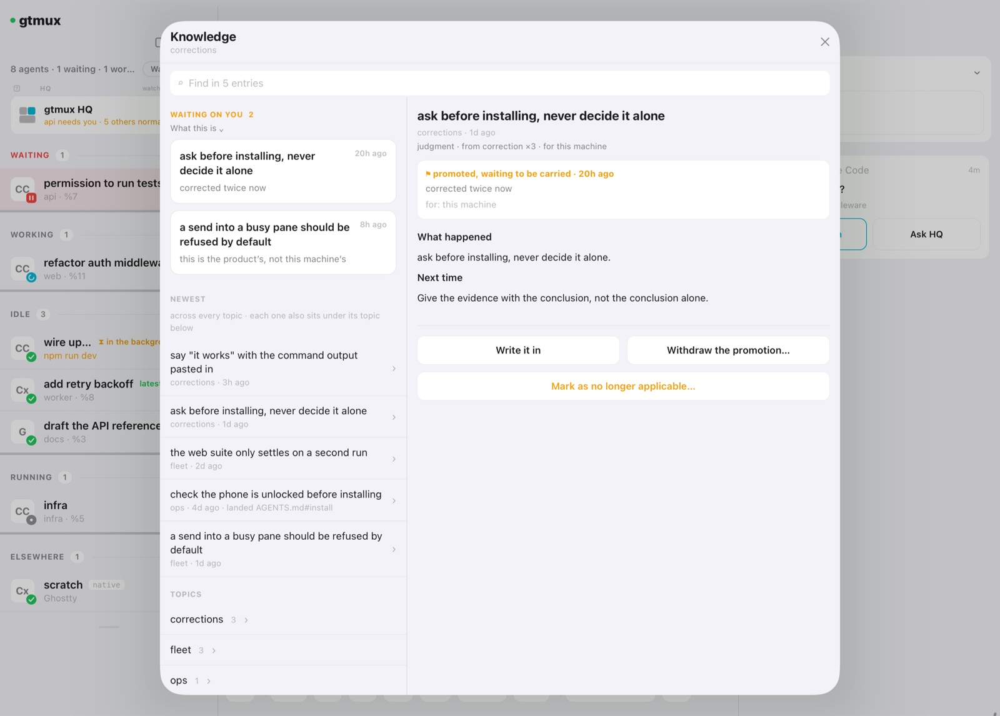

**English** · [中文](hq-supervisor.zh.md)

Past a dozen agents, even the radar is a lot to watch, and you end up polling panes. HQ
takes the watching over. It is one of your own coding agents, started by gtmux in a
tmux session of its own with a charter that teaches it the job: read the fleet, judge
what matters, dispatch work, and bring you only what needs a person.



## Start HQ

Install and sign in to the coding-agent CLI that HQ will run on, and install the gtmux
hook for the agents you use, HQ's included (`gtmux install hooks --agent <name>`): the
hook's events are what wake HQ. Then:

```sh
gtmux hq
```

- With more than one supported agent installed, the first `gtmux hq` asks which one
  should run HQ (Claude Code is the default when it is there) and remembers the answer.
  `gtmux hq --agent codex`, or the `GTMUX_HQ_AGENT` variable, names it outright.
- HQ runs in its own tmux session, `Gtmux HQ`, with its home in `~/.config/gtmux/hq/`.
  There is only ever one: `gtmux hq` from anywhere focuses it, or relaunches it in the same
  window if it quit.
- To put it somewhere else: `--here` (the pane you are typing in), `--pane %N` (an empty
  shell pane) or `--new-pane` (a fresh split of your window). Each refuses while an HQ is
  running.
- Its first message is a startup briefing: one line on who it is, then a status table. On
  the very first launch it ends by asking three questions (what you mainly work on, how you
  want status reported, any quiet hours) and writes your answers into `LOCAL.md`.

The charter HQ follows (`AGENTS.md` in its home) belongs to gtmux. After `gtmux update`,
the next `gtmux hq` regenerates it when a newer one shipped and keeps a backup. Your own
rules go in [`LOCAL.md`](#your-own-rules-localmd), which upgrades never touch. HQ speaks
your language (`GTMUX_LANG`); `gtmux hq --lang en|zh` switches it.

## What wakes HQ, and what stays quiet

HQ has no timer and tails nothing. When something happens that may need a decision,
gtmux types one line into HQ's pane:

<!-- gtmux:rendered wake-lines -->
```
» ◆ gtmux·waiting·permission  api:0.0 (%7) │ title:"run the tests?"
» ▸ gtmux·done  web:2.0 (%11) │ 3m │ goal:"fix the login bug" │ tail:"tests pass" · #a3f1c2
```

The mark after `»` is the weight: `◆` needs a decision, `▸` worth knowing, `·`
bookkeeping. HQ then pulls the details itself (`gtmux events`, `gtmux digest`), judges in
a short turn, and answers in one line. What knocks:

| What happened | Line |
|---|---|
| an agent is waiting on you: a permission, a plan, a question | `waiting·<kind>` |
| that wait cleared, for example you answered in the pane | `resolved` |
| a reply ended with a question but no menu | `asks` |
| an agent finished work you were not watching | `done` |
| a turn died on an agent or API error | `crash` |
| you typed straight into an agent's own pane | `goal-changed` |
| a new agent session appeared | `new-session` |
| a dispatch looks ready to reclaim | `reap-suggest` |
| a pane has waited on you too long | `stuck·waiting` |
| disk, memory, battery, plan limits or a session's context crossed a line | `resource·warn`, `limits·warn`, `usage·warn` |
| remote access dropped or came back | `tunnel` |
| an agent asked HQ something with `gtmux relay ask` | `agent-relay` |
| wakes stopped reaching HQ | `wake-degraded` |

What stays quiet: ordinary progress never reaches HQ's screen. By default a finish in the
pane you are looking at does not wake it, and several finishes in one pane are merged. A
line is never typed over text half-written in HQ's input box; it waits until the box is
empty.

Three more knocks come from gtmux's own clock rather than from an agent:

- **The summary tick.** At most every 10 minutes, sooner after 5 outcomes, and only when
  something changed, HQ gets `tick` and writes one brief of up to six lines.
- **The unread knock.** The table above sets priority, not coverage. gtmux tracks how far
  HQ has read the event stream, and when events sit unread for two minutes it knocks with
  a count and where to read from. It repeats every five minutes until HQ reads them, so an
  event no line claims cannot go missing.
- **Housekeeping.** `self-check` about daily and `distill` about weekly; see
  [below](#self-check-and-self-rotation).

<!-- gtmux:rendered unread-line -->
```
» · gtmux·unread  7 unconsumed (%21 ×4 · %13 ×2 · control) │ pull: gtmux events --since-seq 6653 --json
```

The scheduled knocks come from `gtmux serve`, the same background process remote access
uses, so they need it running. `"hqNudge": false` in `~/.config/gtmux/config.json` stops
the event-driven lines; the intervals are `hqWake` settings
([reference](../cli.md#hqwake-tuning-hqs-wake-channel)). Every line and its exact rule:
[the wake channel](../cli.md#the-wake-channel-how-hq-learns-things).

## The situation board

HQ keeps its picture of the fleet in `~/.config/gtmux/hq/notes/board.md`, so a context
reset or a fresh session does not start from zero: HQ rereads the board before acting.

- At the top, a table with one row per live pane, named by its pane ID (`%23`, the same ID
  `gtmux focus %23` takes), pruned when the work ends.
- Below it, a handoff log, newest first.
- A `Still waiting on you` section for decisions that are yours. The phone and the menu bar
  lift it to the top; most of the time it is empty.

Read it with `gtmux hq --board`, the board button on the menu-bar HQ card, or **Board** on
the phone's HQ page. It is the picture HQ last wrote, not the live radar, so check when it
was updated.

## How HQ triages

Every event in the stream carries a severity, and HQ decides what to print by it:

- `important`: an agent blocked, asking or crashed. Always printed.
- `notable`: changes across the fleet, such as an instruction reaching a session, a turn
  ending, a session starting or ending. Printed unless you
  [turn quiet on](#how-much-hq-says-gtmux-quiet).
- `routine`: written to the board and the ledger, not printed.

You can read the same stream yourself:

```sh
gtmux events --severity important    # what is blocked, asking or crashed
gtmux events --severity notable      # what changed across the fleet
gtmux events --since 24h --acts      # what HQ itself did today
```

A tool finishing mid-turn without ending a wait is not recorded at all. Before it passes on
"api needs you", HQ checks the live state again and drops the item if you already
answered in that pane. Its answers to wake lines are single lines, so they scan apart from
conversation:

| Reply | Means |
|---|---|
| `⟣ ✅ …` | a completion worth knowing, and the next step |
| `⟣ ▪ noted: …` | routine, written to the board |
| `⟣ 📓 captured: …` | a lesson went into the knowledge base |
| `⟣ ⚠ …` | something needs you |
| `⟣ ◈ brief …` | the periodic brief |

## When HQ decides and when it asks you

You can work with HQ three ways: dispatch something yourself, adopt a suggestion it made,
or talk it through and let HQ decide. In the last case it acts on its own only when the
step is **reversible, low-risk and inside a direction you already discussed**, and it says
what it did and to whom. It brings the decision to you when the step:

- cannot be undone,
- touches permissions or credentials,
- changes the plan or the approach, or
- falls outside what you discussed.

It never answers another agent's permission, plan or question prompt for you; it brings
the prompt to you with its recommendation. It does not send arrow or Tab keys into an
agent's screen, and it runs no project commands itself: builds, git, even a read-only look
at a repo go to an agent it picks or spawns.

When an instruction has two readings that lead to different work, HQ names the one it is
taking in a sentence and starts. It stops to ask only when one reading cannot be undone,
reaches outside this machine, or touches credentials.

Everything it escalates goes on your plate and stays there until it is answered:

```sh
gtmux tasks --pending     # what is waiting on your decision
```

On the phone the same list is HQ → **Your call**. `gtmux advice --tally` keeps HQ honest
the other way: it counts how often its advice was taken or declined.



## Dispatch and reclaim work

You or HQ start work with `gtmux spawn`:

```sh
gtmux spawn --title fix-login --cwd ~/src/app "fix the login redirect loop"
gtmux spawn --title bump-deps --cwd ~/src/app --worktree chore/deps --goal-file /tmp/goal.txt
gtmux spawn --pane %14 "keep going, then run the tests"
```

- `--title` names the window with a short verb-object slug, and the report hands back
  `<loc> (%pane) · <title>` so you can jump by number.
- `--cwd` picks the project, `--worktree <branch>` gives the agent its own git worktree,
  and `--agent` and `--model` choose who does the work. HQ sets both on every dispatch by
  how hard the task is, and tells you which it picked.
- A goal longer than a line goes through `--goal-file`, so no shell touches the text.
- Delivery is verified: gtmux waits until the agent is ready, pastes the goal, and
  confirms it arrived, from the agent's own prompt event where a hook exists or by reading
  the screen. A failure reads `✗ NOT delivered` with what it saw, and running the same
  spawn again reuses what the first attempt created.
- Neither `spawn` nor `gtmux send` types into an input box that holds someone else's
  unsent text: they refuse and quote the draft back.

Track and reclaim:

```sh
gtmux tasks                        # every dispatch and its live state, undelivered and waiting first
gtmux reap <task_id>               # close a finished dispatch
gtmux reap <task_id> --snooze      # keep it, and stop suggesting
```

`reap` checks that the worktree is clean and the branch is merged, and only then closes the
session, removes the worktree and deletes the branch; otherwise it says what blocks it and
changes nothing. HQ proposes a reap when one looks ready (`reap-suggest`) and runs it only
after you agree.

Agents can talk to HQ too. From a worker pane, `gtmux relay report` files progress
quietly and `gtmux relay ask` files a question that wakes HQ. A decision only you can make
(`--for user`) still comes to you: HQ cannot approve it for you
([relay](../cli.md#gtmux-relay-agent-requests-to-hq)).

## Ask HQ things

HQ is an agent session: type to it in its pane, or from the phone.

- Ask for "status" and you get a table: who needs you first, then what is working and what
  finished, token use, and how much of your plan window is left.
- The phone's HQ page has one-tap prompts: **Brief**, **Who's waiting**, **What's
  important** and **My call**.
- The menu-bar popover shows HQ as its own card above the sessions. Click it to jump to
  HQ's pane; the icons in its header open the board and the knowledge base.
- On iPad, HQ's conversation sits beside what is waiting on you and what HQ did.

## Knowledge, and learning from corrections

HQ keeps a knowledge base of what it learns: how an account's login works, a network quirk,
a footgun someone already paid for.

- When you correct HQ, an agent crashes, or the same trap is hit a second time, HQ either
  files a lesson (`⟣ 📓 captured`) or says in a clause why there is nothing lasting in it.
- Any agent can drop a candidate:
  `gtmux capture "wrangler TLS-resets on the office network; retry @pitfalls"`. Once a day
  gtmux also reads the agents' session logs, with no model, and queues the places where you
  corrected an agent or a tool failed again and again. About once a week (`distill`) HQ files or dismisses each candidate, with a reason.
- Before it advises you or dispatches work, HQ searches the base and names the entry its
  advice rests on. `gtmux spawn` prints matching entries before it dispatches.
- A lesson bigger than this machine gets promoted: into `LOCAL.md`, to every agent on this
  Mac, into one repository's `AGENTS.md`, or to gtmux itself as a pre-filled issue.
- Your own details, such as an account or a personal fact, go in only after HQ shows you
  the exact text and you say yes.

Where the base lives, the commands, and what you can change yourself:
[What HQ remembers](../knowledge.md).



## Your own rules: LOCAL.md

`~/.config/gtmux/hq/LOCAL.md` is yours. It is imported at the end of the charter, so what
you write there extends and overrides what gtmux ships, and no upgrade overwrites it. For
example:

```markdown
- I mostly work on the api and web repos; the mobile app can wait.
- Report in one short table, no prose.
- Quiet hours 22:00–08:00: interrupt me only for something blocked.
```

If you want HQ to always do something, write it in `LOCAL.md`. If you want it to remember
something it worked out, that is the knowledge base: a correction you give HQ in
conversation becomes an entry there, and one that should govern HQ from then on can be
promoted into `LOCAL.md` as a marked section.

## Self-check and self-rotation

HQ has no clock, so gtmux raises its housekeeping:

- `self-check`, about daily: HQ tidies its own records (stale entries in its ledger, the
  event log's health, the knowledge base's lint report) and says nothing unless it did
  real work.
- `distill`, about weekly, sooner once five captures are queued: it folds the period's
  lessons into the knowledge base and prunes stale ones.

`gtmux doctor` flags either one when it is overdue.

**Self-rotation.** Deep into a long, nearly full session, an agent starts to mix up what it
wrote with what it was told, and it cannot catch that from the inside. So gtmux watches
HQ's session from outside and knocks `self-rotate` when one of these crosses its line:
context 75% full, 12 hours old, or 300 turns. Without asking you, HQ then brings the board
and the knowledge base up to date, writes a handoff, and runs `gtmux hq --rotate`. gtmux
sends the agent's own reset (`/clear`, or `/new` for Codex) after the turn ends and only
into an empty input box, and only a new session ID counts as done. The next session reads
the board and carries on. The lines are `hqWake` settings, and `gtmux doctor`'s HQ
conversation health row shows the current figures
([details](../cli.md#self-rotation-when-hqs-own-session-is-the-problem)).

## How much HQ says: gtmux quiet

```sh
gtmux quiet on       # only CRITICAL reaches you
gtmux quiet off      # back to the default, NORMAL and above
gtmux quiet status   # what is in effect now
```

Quiet changes what HQ prints, not what it records. One thing is never quieted: a gap in
the event log, which means HQ may have missed something.

## Move HQ to another Mac

HQ's records (the board, the knowledge base and your `LOCAL.md`) are the one thing gtmux
holds that it cannot rebuild. Export them as one passphrase-locked file:

```sh
gtmux hq --export ~/gtmux-hq.tar.gz        # asks for a passphrase, writes gtmux-hq.tar.gz.age
gtmux hq --import ~/gtmux-hq.tar.gz.age    # on the other Mac, with HQ not running
gtmux hq --records                         # size, backup state, last export
```

`--import` replaces the whole home and moves the one already there aside to
`hq.replaced-<timestamp>`; run `gtmux hq` afterwards so HQ starts from the restored board.
Lose the passphrase and the file stays shut; gtmux keeps no copy. The rest of a move
(hooks, pairing the phone again) is in [Moving to a new Mac](../install.md#moving-to-a-new-mac).

To bring over only the knowledge base or `LOCAL.md` and review it first, use
`gtmux hq migrate`, or the menu bar's HQ → Knowledge → Import… → Move from another Mac…
([selective migration](../cli.md#hq-backup-restore-and-selective-migration)).

`gtmux serve` also snapshots the records daily to `~/.local/share/gtmux/hq-snapshots/`
and keeps 14. They sit on the same disk, so keep an export somewhere else too.

---

Next: [Manage from your phone and the web](phone-and-web.md) ·
[Attach from any computer](attach-from-anywhere.md) · Every flag:
[`gtmux hq` in the CLI reference](../cli.md#gtmux-digest--gtmux-hq-hq-the-supervisor-session)
