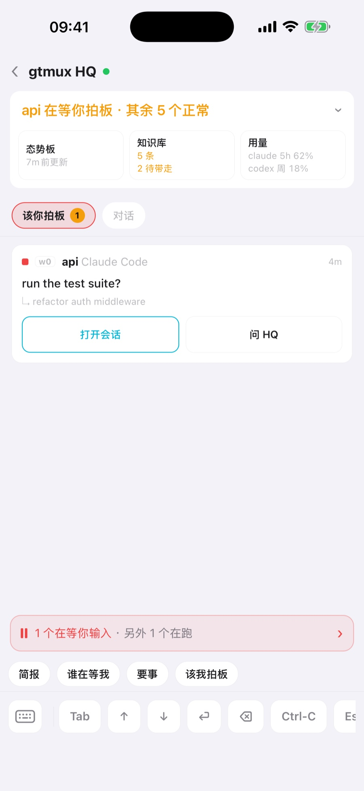

[English](hq-supervisor.md) · **中文**

agent 一多，连雷达也盯不过来，最后还是你在挨个查 pane。HQ 把盯梢接过去。它就是你自己的一个 coding agent，由 gtmux 放在一个专属 tmux 会话里，带着一份写好职责的章程：看全局、判断轻重、派活，只把需要人拍板的事交给你。


## 启动 HQ

先装好并登录 HQ 要用的 coding agent CLI，再给你在用的 agent（包括 HQ 自己）装上 gtmux hook（`gtmux install hooks --agent <名字>`）：唤醒 HQ 靠的就是 hook 上报的事件。然后：

```sh
gtmux hq
```

- 装了不止一个受支持的 agent 时，第一次 `gtmux hq` 会问用哪个来跑 HQ（有 Claude Code 就默认它），并记住你的选择。`gtmux hq --agent codex` 或环境变量 `GTMUX_HQ_AGENT` 可以直接指定。受支持的 agent 都能跑 HQ，但[自轮换](#自检与自轮换)只支持 Claude Code 和 Codex。
- HQ 跑在自己的 tmux 会话 `Gtmux HQ` 里，家目录是 `~/.config/gtmux/hq/`。HQ 永远只有一个：在哪儿敲 `gtmux hq` 都是切过去；它退出了，就在原窗口重新拉起。
- 想换个位置：`--here`（你正敲命令的这个 pane）、`--pane %N`（一个空 shell pane）、`--new-pane`（在当前窗口拆一个新 pane）。已有 HQ 在跑时三者都会拒绝。
- 它的第一条消息是启动简报：一句自我介绍，加一张现状表。第一次启动时，简报最后会问你三个问题（主要在做什么、想怎么收汇报、有没有免打扰时段），并把回答写进 `LOCAL.md`。

HQ 遵循的章程（家目录里的 `AGENTS.md`）归 gtmux 所有。`gtmux update` 之后，如果带来了新版章程，下次 `gtmux hq` 会重新生成，旧的留备份。你自己的规矩写在 [`LOCAL.md`](#你自己的规矩localmd)，升级永远不碰它。HQ 跟随你的语言（`GTMUX_LANG`），`gtmux hq --lang en|zh` 可以切换。

## 什么会叫醒 HQ，什么不会

HQ 没有定时器，也不盯日志。发生了可能要拍板的事，gtmux 往 HQ 的 pane 里敲一行：

<!-- gtmux:rendered wake-lines -->
```
» ◆ gtmux·waiting·permission  api:0.0 (%7) │ title:"run the tests?"
» ▸ gtmux·done  web:2.0 (%11) │ 3m │ goal:"fix the login bug" │ tail:"tests pass" · #a3f1c2
```

`»` 后面那个符号是分量：`◆` 要拍板，`▸` 值得知道，`·` 记账。HQ 随后自己去拉细节（`gtmux events`、`gtmux digest`），用一个短回合判断完，回一行。会敲门的事：

| 发生了什么 | 那一行 |
|---|---|
| 有 agent 在等你：授权、计划或提问 | `waiting·<kind>` |
| 那个等待解除了，比如你已经在 pane 里回了 | `resolved` |
| 回复末尾问了个问题，但没给菜单 | `asks` |
| 一个你没在看的 agent 干完了活 | `done` |
| 这一回合死在 agent 或 API 报错上 | `crash` |
| 你直接在某个 agent 自己的 pane 里下了指令 | `goal-changed` |
| 出现了一个新的 agent 会话 | `new-session` |
| 某次派活看起来可以收尾了 | `reap-suggest` |
| 某个 pane 等你太久了 | `stuck·waiting` |
| 磁盘、内存、电量、订阅额度或某个会话的上下文越线 | `resource·warn`、`limits·warn`、`usage·warn` |
| 远程访问断了或恢复了 | `tunnel` |
| 有 agent 通过 `gtmux relay` 提了一个阻塞请求 | `agent-relay` |
| 唤醒送不到 HQ 了 | `wake-degraded` |

不会打扰它的：普通的进展永远不上 HQ 的屏幕。默认情况下，你正看着的 pane 干完活不叫醒它，只记进下一条简报；但如果这个 pane 的活是 HQ 派的（spawn 或 send 过去的），HQ 在等它，照样会被叫醒。同一个 pane 连着完成几次会合并成一条。HQ 输入框里有写了一半的字时绝不往里敲，等输入框空了再送。

还有三种不是 agent 触发、而是 gtmux 按钟点来敲的：

- **定时简报**：最多每 10 分钟一次，攒够 5 个结果会提前，而且只在真有变化时才来。HQ 收到 `tick`，写一条不超过六行的简报。
- **未读提醒**：上面那张表管的是先后，不管全不全。gtmux 记着 HQ 读到了事件流的哪儿，事件压了两分钟没读，就敲门报一个数和从哪儿读；之后每五分钟再敲，直到 HQ 读完。所以哪一类都没认领的事件也丢不了。
- **家务**：`self-check` 约每天一次，`distill` 约每周一次，见[下文](#自检与自轮换)。

<!-- gtmux:rendered unread-line -->
```
» · gtmux·unread  7 unconsumed (%21 ×4 · %13 ×2 · control) │ pull: gtmux events --since-seq 6653 --json
```

这里不少事靠 `gtmux serve`（远程访问用的也是这个后台进程），所以它得一直在跑。关于回合的那些行由各 agent 的 hook 直接发（`waiting·<kind>`、`resolved`、`asks`、`done`、`crash`、`goal-changed`、`new-session`、`reap-suggest`、`usage·warn`），`agent-relay` 由 `gtmux relay` 发；其余都来自 serve：上面这三种，`stuck·waiting`、`resource·warn`、`limits·warn`、`tunnel`、`wake-degraded`、`self-rotate`，还有 `gtmux hq --rotate` 排队的那次重置。因为输入框不空、或者落在某个 pane 的合并时间窗里而暂缓的行，由 serve 几秒后的下一轮送出，或者等到下一个回合结束。

在 `~/.config/gtmux/config.json` 里写 `"hqNudge": false` 只关掉 hook 发的那些行，`agent-relay` 和 serve 发的照样会到。间隔在 `hqWake` 里调（[参考](../cli.zh.md#hqwake调-hq-的唤醒通道)）。每一类的完整规则见[唤醒通道](../cli.zh.md#唤醒通道hq-怎么知道事情)。

## 态势板

HQ 把它对全局的判断写在 `~/.config/gtmux/hq/notes/board.md`。上下文重置或换了新会话，它先重读态势板再动手，不用从零摸起。

- 上面是一张表，每个在跑的 pane 一行，用 pane ID 命名（`%23`，和 `gtmux focus %23` 用的是同一个），活干完就删。
- 下面是交接记录，新的在最上面。
- 「还等你定的」一节专放需要你决定的事，手机和菜单栏会把它提到最顶上；大多数时候它是空的。

用 `gtmux hq --board`、菜单栏 HQ 卡片上的态势板按钮，或手机 HQ 页的**态势板**来看。它是 HQ 最近一次写下的样子，不是实时雷达，看的时候留意更新时间。

## HQ 怎么分轻重

事件流里每条事件都带严重度，HQ 按它决定说不说：

- `important`：有 agent 卡住、在问或崩了。一定说。
- `notable`：全局有变化，比如一条指令送到了某个会话、一个回合结束、会话起停。除非你[开了 quiet](#hq-说多少gtmux-quiet)，否则会说。
- `routine`：只记进态势板和台账，不说。

同一条事件流你也能自己读：

```sh
gtmux events --severity important    # 谁卡住了、在问、崩了
gtmux events --severity notable      # 全局有什么变化
gtmux events --since 24h --acts      # 最近 24 小时的监督记录：HQ 的动作，加上 gtmux 自己发起的触发
```

回合中途某个工具跑完、又没解除任何等待的，根本不记。转告「api 在等你」之前，HQ 会再看一眼实时状态，你已经在那个 pane 里回过了，它就不再转。它回复唤醒行都以 `⟣` 加一个符号开头，每条一行，只有定时简报可以再带最多五行缩进，所以和对话一眼分得开：

| 回复 | 意思 |
|---|---|
| `⟣ ✅ …` | 一次值得知道的完成，以及下一步 |
| `⟣ ▪ noted: …` | 例行事项，已记进态势板 |
| `⟣ 📓 captured: …` | 一条经验进了知识库 |
| `⟣ ⚠ …` | 有事要你定 |
| `⟣ ◈ 简报 …` | 定时简报 |

## HQ 什么时候自己定，什么时候问你

和 HQ 配合有三种方式：你自己派，采纳它的建议，或者和它商量完让它定。最后这种情况下，只有一步**可撤销、低风险、而且在你们已经谈过的方向之内**，它才自己做，并说清做了什么、交给了谁。下面这些它会交回给你：

- 做了就撤不回的，
- 碰到权限或凭据的，
- 改变计划或做法的，
- 超出你们谈过的范围的。

别的 agent 弹出的授权、计划或提问，它绝不替你回答，而是带着建议转给你。它不往 agent 的界面里发方向键或 Tab，也不亲自跑项目里的命令：构建、git，哪怕只是看一眼仓库，都交给它挑中或新起的 agent。

一条指令有两种理解、会做出不同的活时，HQ 用一句话说明它按哪种理解，然后直接开始。只有其中一种理解撤不回、会伸出这台机器、或碰到凭据时，它才停下来问。

交给你的事都会放上你的待办，答完才撤下：

```sh
gtmux tasks --pending     # 等你拍板的事
```

这是 HQ 记的一本账，上面的每一项都是 HQ 放上去的。手机上 HQ → **该你拍板** 是另一回事：它实时列出此刻在等你的 agent，等得最久的在前。反过来，`gtmux advice --tally` 记着它提的建议被采纳和被否的次数。



## 派活与收尾

你或 HQ 都用 `gtmux spawn` 开工：

```sh
gtmux spawn --title fix-login --cwd ~/src/app "fix the login redirect loop"
gtmux spawn --title bump-deps --cwd ~/src/app --worktree chore/deps --goal-file /tmp/goal.txt
gtmux spawn --pane %14 "keep going, then run the tests"
```

- `--title` 用一个「动词-宾语」的短名给窗口起名，回报里给出 `<loc> (%pane) · <title>`，按编号就能跳过去。
- `--cwd` 指定项目，`--worktree <分支>` 给 agent 一个独立的 git worktree，`--agent` 和 `--model` 决定谁来干。HQ 每次派活都把这两项定下来：agent 看哪个适合这件活，模型看任务有多难，并告诉你选了什么。
- 超过一行的任务写进文件，用 `--goal-file` 交出去，文字不经过 shell。
- 送达是核验过的：gtmux 等 agent 就绪，把任务贴进去，再确认它真收到了（有 hook 的看 agent 自己的提交事件，没有就读屏幕）。没送到会打印 `✗ 未送达 → <loc> (%pane) · <title>。证据：`，后面是它看到的东西；同一条 spawn 再跑一次，会接着用上次建好的东西。
- 输入框里有别人没发出去的字时，`spawn` 和 `gtmux send` 都不往里敲，而是拒绝，并把那段草稿原样给你看。

跟踪和收尾：

```sh
gtmux tasks                        # 每次派活和它的实时状态，没送到的和在等的排前面
gtmux reap <task_id>               # 收掉一次干完的派活
gtmux reap <task_id> --snooze      # 留着：24 小时内不再建议回收（--for 72h 换个时长）
```

`reap` 先确认 worktree 干净、分支已合并，才会关会话、删 worktree、删分支；否则只说明卡在哪，什么都不动。HQ 看到能收尾的会提议（`reap-suggest`），你同意了才执行。

agent 也能找 HQ。在干活的 pane 里，`gtmux relay report` 报进度，`gtmux relay ask` 提问。阻塞的请求才会叫醒 HQ：`ask` 默认就是阻塞的（加 `--nonblocking` 才不是），`report` 要带 `--blocking` 或 `--for user`；其余的安静地记进台账。只有你能拍板的事（`--for user`）照样回到你手里，HQ 替不了你（[relay](../cli.zh.md#gtmux-relayagent-向-hq-汇报和提问)）。

## 向 HQ 提问

HQ 就是一个 agent 会话：在它的 pane 里打字，或者在手机上问。

- 问「status」会得到一张表：先列等你的，再列在跑的和跑完的，还有 token 用量和订阅窗口剩多少。
- 手机 HQ 页有一键提问：**简报**、**谁在等我**、**要事**、**该我拍板**。
- 菜单栏面板里，HQ 是会话列表上方单独的一张卡片。点它跳到 HQ 的 pane，卡片标题栏的图标打开态势板和知识库。
- iPad 上，HQ 的对话旁边就是等你的事和 HQ 做过的事。

## 知识库，以及从纠正里学习

HQ 把学到的东西记进知识库：某个账号怎么登录、某个网络的毛病、别人已经踩过的坑。

- 你纠正了 HQ、某个 agent 崩了、或者同一个坑踩到第二次时，HQ 要么记下一条经验（`⟣ 📓 captured`），要么用一句话说明为什么没有值得留的东西。
- 任何 agent 都能投一条候选：`gtmux capture "wrangler TLS-resets on the office network; retry @pitfalls"`。gtmux 每天还会读一遍各 agent 的会话日志（不调用模型），把你纠正 agent 的地方和反复失败的工具排进队列。大约每周一次（`distill`），HQ 逐条归档或驳回，并写明理由。
- 给你建议或派活之前，HQ 先查知识库，并说出它的建议依据哪一条。`gtmux spawn` 派活前也会列出相关条目。
- 超出这台机器的经验会被提升：进 `LOCAL.md`、给这台 Mac 上的所有 agent、进某个仓库的 `AGENTS.md`，或者以预填好的 issue 交给 gtmux 本身。
- 你自己的信息（账号、个人情况）只有在 HQ 把原文给你看过、你点头之后才会记。

知识库存在哪、有哪些命令、你自己能改什么，见 [HQ 记住的东西](../knowledge.zh.md)。


## 你自己的规矩：LOCAL.md

`~/.config/gtmux/hq/LOCAL.md` 归你。它在章程末尾导入，所以你写的会补充并覆盖 gtmux 自带的内容，任何升级都不会覆盖它。比如：

```markdown
- 我主要做 api 和 web 两个仓库，手机 app 可以往后放。
- 汇报用一张短表，不要大段文字。
- 22:00–08:00 免打扰：只有卡住的事才叫我。
```

想让 HQ 一直照做的，写进 `LOCAL.md`；想让它记住自己摸索出来的，那是知识库的事。你在对话里给 HQ 的纠正会变成知识库里的一条；如果它应该从此约束 HQ 本身，可以提升进 `LOCAL.md`，作为带标记的一节。

## 自检与自轮换

HQ 没有时钟，家务由 gtmux 来提醒：

- `self-check`，约每天一次：HQ 整理自己的档案（台账里过期的条目、事件日志是否健康、知识库的检查报告），没做实事就不出声。
- `distill`，约每周一次，攒够五条候选会提前：把这段时间的经验折进知识库，剪掉过期的。

哪一项过期没做，`gtmux doctor` 都会标出来。

**自轮换。** 会话又长又满时，agent 会开始分不清哪些是自己写的、哪些是别人说的，而且从里面察觉不到。所以 gtmux 从外面盯着 HQ 的会话，上下文用到 75%、会话满 12 小时、或者满 300 个回合，任一条越线就敲 `self-rotate`。HQ 不问你，直接把态势板和知识库更新到位、写好交接，再执行 `gtmux hq --rotate`。gtmux 等这一回合结束、输入框为空时，才发出 agent 自己的重置命令（Claude Code 是 `/clear`，Codex 是 `/new`），只有出现新的会话 ID 才算完成。新会话读完态势板接着干。gtmux 只认识这两个重置命令：换成别的 agent 当 HQ，`--rotate` 会拒绝，要开新会话就得退出 agent，再跑一次 `gtmux hq`。这几条线是 `hqWake` 设置，`gtmux doctor` 的 HQ 会话健康那一行显示当前数值（[详情](../cli.zh.md#自轮换hq-自己的会话成了问题)）。

## HQ 说多少：gtmux quiet

```sh
gtmux quiet on       # 只有 CRITICAL 才会到你面前
gtmux quiet off      # 关掉 quiet 开关
gtmux quiet status   # 现在生效的是哪档
```

`quiet off` 只关这个开关：`config.json` 里的 `surfaceTier`，以及单个进程的 `GTMUX_SURFACE_TIER`、`GTMUX_QUIET`，仍然能定门槛；都没有时是 NORMAL 及以上，`quiet status` 显示实际生效的那档。quiet 只改 HQ 说什么，不改它记什么。只有一件事永远不静音：事件日志出现缺口，意味着 HQ 可能漏看了东西。

## 把 HQ 搬到另一台 Mac

HQ 的档案（态势板、知识库和你的 `LOCAL.md`）是 gtmux 里唯一没法重建的东西。导出成一个带口令的文件：

```sh
gtmux hq --export ~/gtmux-hq.tar.gz        # 要你设口令，写出 gtmux-hq.tar.gz.age
gtmux hq --import ~/gtmux-hq.tar.gz.age    # 在另一台 Mac 上，先退出 HQ
gtmux hq --records                         # 大小、备份情况、上次导出
```

`--import` 替换整个家目录：原来的会挪到旁边一个名为 `hq.replaced-…` 的文件夹，路径会打印出来。之后跑一次 `gtmux hq`，让 HQ 从恢复的态势板开始。口令丢了文件就打不开，gtmux 不留副本。换机的其余步骤（hook、手机重新配对）见[换一台 Mac](../install.zh.md#换一台-mac)。

只想搬知识库或 `LOCAL.md`、并且先过目，用 `gtmux hq migrate`，或者菜单栏的 HQ → 知识库 → 导入… → 从另一台 Mac 迁移…（[选择性迁移](../cli.zh.md#hq-备份恢复与选择性迁移)）。

`gtmux serve` 每天还会把档案快照到 `~/.local/share/gtmux/hq-snapshots/`，保留 14 份。它们和原件在同一块硬盘上，所以导出的文件另存一处。

---

接下来：[用手机和网页远程管理](phone-and-web.zh.md) · [从任意电脑接回会话](attach-from-anywhere.zh.md) · 全部参数：[CLI 参考里的 `gtmux hq`](../cli.zh.md#gtmux-digest--gtmux-hqhq也就是中控会话)
