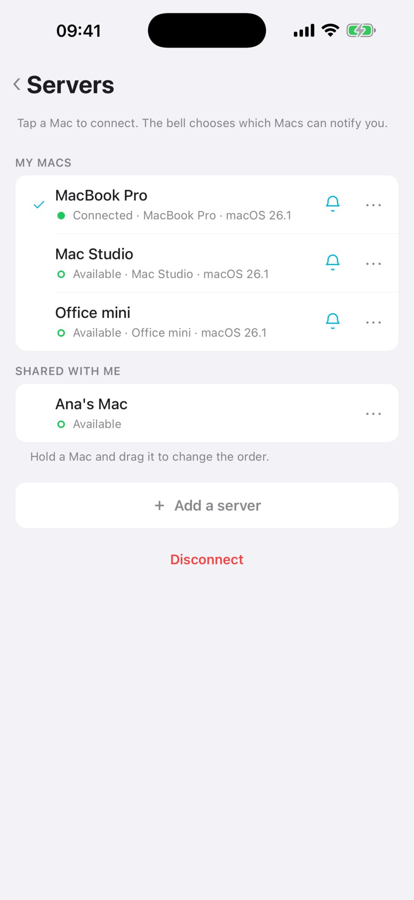
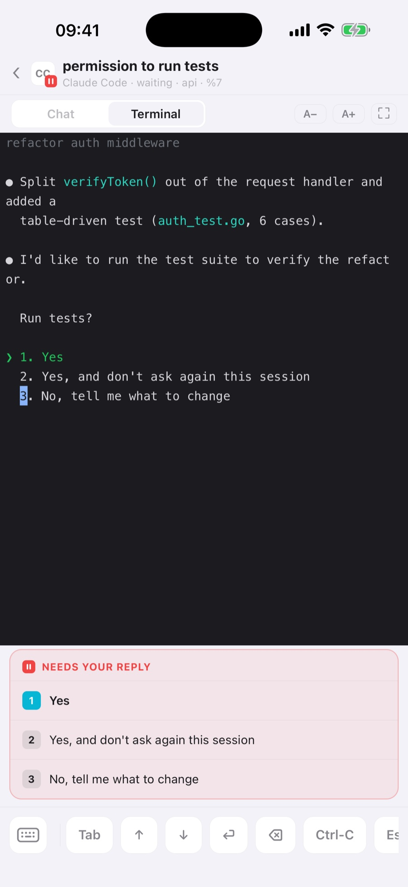
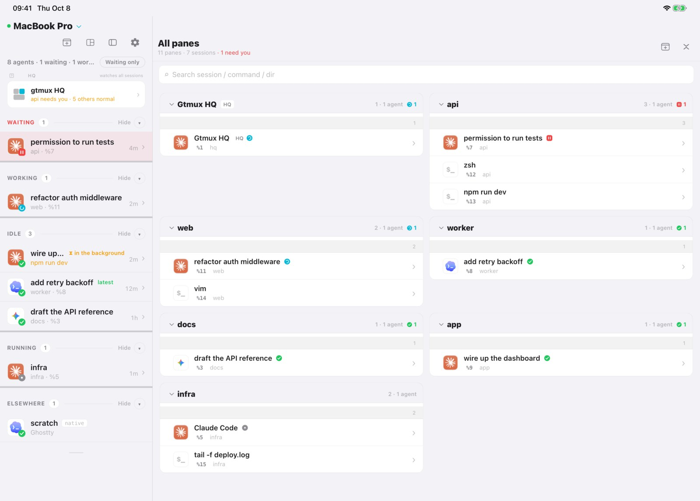
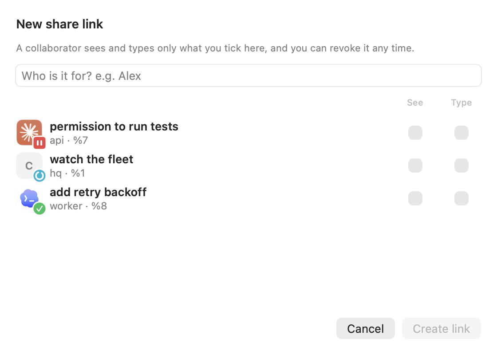

**English** · [中文](phone-and-web.zh.md)

Use the iPhone and iPad app to check your agents, answer a request and talk to HQ while
away from the Mac. A browser can also show the radar and let you type into panes.

## Choose Pair or Share

| What you want | Use | Access |
|---|---|---|
| Connect your own iPhone, iPad or browser | **Pair** | Owner access to the Mac, including HQ and sharing controls |
| Let someone else watch or help with a task | **Share** | Only the panes you select; view-only or allowed to type |

**Pair is for your own devices. Send collaborators a Share link.**

## Pair your iPhone or iPad

Install [gtmux from the App Store](https://apps.apple.com/app/id6791144062).
The same app works on both devices. Keep the Mac awake during setup and use.

1. On the Mac, open the gtmux menu-bar app → **Preferences → Remote access**.
   Choose **Local network** if both devices are on a reachable local network, or
   **Anywhere** to connect from other networks. Follow the prompts to turn it on.
2. In the menu bar, open **Pair a device…** to display the pairing QR.
3. On the iPhone or iPad, tap **Add a server → Scan pairing QR** and scan it.

The Mac now appears in the app's server list. Open it to see the radar.
A pairing code works once; generate a new one for each device.



Prefer the terminal? Start `gtmux serve` on a local network or `gtmux tunnel` for remote
access, then run `gtmux pair` for the QR.

### Pair a browser

Generate a fresh code with `gtmux pair` and open the browser link it prints. The browser
becomes your own paired device, with access to the radar and terminal input. Use Share
when someone else needs access.

## Use the app

On **iPhone**, tap an agent to read its conversation or terminal. When it needs a reply,
choose an offered answer or type your own. You can also send control keys or a screenshot.

In the terminal, **Wrap** fits each captured row to the screen. If Codex history or a diff looks broken across short rows,
choose **Original** to preserve the Mac's row layout and scroll horizontally. This changes only the app's display.
For conversation prose, use Chat; Codex's truncated pinned prompt has its own full-text reader.



On **iPad**, a wide window keeps the radar in a sidebar and the selected session beside
it. Tap another row to switch sessions. A narrow window uses the iPhone layout.



Open **HQ** for its conversation, situation board and knowledge base. Tap the server name
to switch between Macs. To create a shell session on a paired Mac, tap **New session**;
you can start your agent in the terminal it opens.

Allow iOS notifications if you want alerts when an agent needs you or finishes. The Mac
must stay awake with serve running; delivery also depends on network and notification
settings. A guest connection does not receive these notifications.

## Open one pane to a collaborator

In the Mac menu-bar app, open **Preferences → Sharing → New share…**. Enter a label,
select which panes the guest can **See**, and tick **Type** only where they may send input.
Create the link and send it to them. They open it in a browser or redeem it in the iOS app.



For input to work, also enable guest typing in Sharing. A view-only link needs no input
permission. Guests do not see the HQ page or owner controls.

From the terminal, a view-only link that expires in 24 hours is:

```sh
gtmux share new --label alice --view %7 --expires 24h
```

Replace `%7` with the pane you want to share (`gtmux panes` lists the IDs). To allow
replies in that pane, add `--type %7` when creating the link and enable `gtmux share on`.
A guest who can type can operate the programs in that pane, with those programs' permissions.

## End access

Revoke a guest link in Sharing when the task is done, or use `gtmux share revoke <id>`.
You can also manage guest links from a paired phone under **Settings → Sharing & pairing**.

If your own device is lost, revoke it **on the Mac**: `gtmux devices` lists its ID, and
`gtmux devices revoke <id>` removes its access. Keep pairing codes and share links private.

---

Connection choices or a connection problem? [Remote access reference](../phone.md).
Want a full terminal on another computer? [Attach from any computer](attach-from-anywhere.md).
Full parameters: [Pair](../cli.md#gtmux-pair-enroll-your-own-devices-full-control) ·
[Share](../cli.md#gtmux-share-scoped-revocable-access-for-a-collaborator).
