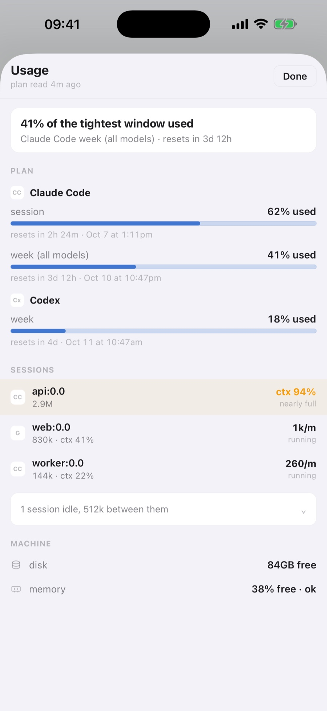

**English** · [中文](phone-and-web.zh.md)

An agent run takes half an hour, and you do not have to sit there for it. This guide does
two things. It pairs your own phone and browser to the Mac, so you can watch, reply and get
notified from anywhere. Then it opens one session to a collaborator for a while, with the
permissions staying in your hands.

## Open the door on your Mac

```sh
gtmux serve                # the phone is on the same local network
gtmux tunnel               # a public HTTPS address over an outbound tunnel
```

On the same network `serve` is enough. Away from it, `tunnel` gives the Mac an `https://…`
address with no port forwarding and no VPN; it starts `serve` if needed, and
`gtmux tunnel --service` keeps it on across reboots. The networks on both ends still have to
allow the connection: some corporate Wi-Fi blocks the standard tunnel.

No terminal needed: in the menu-bar app, click the gtmux icon → ⚙︎ → Preferences… → Remote
access. It has the same three-way switch (Off / Local network / Anywhere), and under
Anywhere a connection method: Standard (free, on Cloudflare's network) or Direct (over port
443 through gtmux's own server, unlocked with an access code, for networks that block
Standard). The reachable address shows while it is on.

Tunnels, Tailscale, self-hosting and the security model in full:
[Mobile and remote access](../phone.md#from-anywhere-gtmux-tunnel-recommended).

## Pair your phone

```sh
gtmux pair
```

It prints one pairing code three ways: a QR for the phone, a link for a browser, and a
`gtmux attach` line for another computer's terminal. In the iOS app
([App Store](https://apps.apple.com/app/id6791144062)) tap **Add a server** → **Scan pairing QR**.
The menu bar's ⚙︎ → Pair a device… shows a pairing QR too, and turns remote access on
first if it is off.

After that the phone has the whole kit:

- the radar, with the same colours and order as on the Mac;
- each session's live screen, with replies, control keys and screenshots sent into it;
- the `1 / 2 / 3` card when an agent asks for permission;
- lock-screen notifications when an agent needs you or finishes;
- the HQ page, and a usage sheet with your plan windows and each session's context;
- several Macs in one list, switching with a tap, with a bell that chooses which ones can
  notify you.

Notifications travel through gtmux's push relay and Apple's push service, so the Mac must
be awake with `gtmux serve` running, and the phone's notification settings must allow them.

This is your own device: full control, the same as sitting at the Mac.




## Or use a browser, with nothing to install

A pairing code works once, and your phone just used it. Run `gtmux pair` again and open its
browser link in any browser: a borrowed laptop, an office Windows machine, a tablet. You get
the radar and each pane's screen, and you can type into panes.

## Open one session to a collaborator

```sh
gtmux share new --label alice --view %7 --type %7 --expires 24h   # a guest link: see and type in this pane, gone in 24h
gtmux share on                                                    # master switch: allow guest typing at all
gtmux share set <id> --type %7,%8                                 # change one link later
gtmux share revoke <id>                                           # done: the link is refused from now on
```

- `--view` is what the guest can see; `--type` is where they can type, and those panes are
  added to view too. `--expires` takes minutes, hours or days (`45m`, `24h`, `7d`);
  without it the link does not expire.
- Typing also needs the master switch, `gtmux share on`, which is off until you turn it on.
- They open the link in a browser, or redeem it in the iOS app, and stay a guest either
  way: they see only the panes you listed, and get none of the owner settings or HQ.
- `share revoke` refuses the link's next request at once.

A guest who can type is operating the shell or agent in that pane, with that program's
own permissions. Share scopes decide which panes, not what the program inside may do.

You can also manage links from the menu bar's Preferences → Sharing, or from a paired phone
under Settings → Sharing & pairing.

## Keep it safe

- A pairing code is single-use and expires in five minutes.
- **A paired device's credential is a password.** Lost the phone? On the Mac, run
  `gtmux devices` to find its ID, then `gtmux devices revoke <id>`. Do it promptly: until
  you do, that device can still type into panes and mint new pairing codes.
- Revoking devices and switching remote access on or off happen on the Mac; the phone's
  screens do not offer them, and a guest never sees them.
- Guests and your own devices are separate tracks: `pair` is full control, `share` is
  scoped. A guest cannot register for notifications or use `gtmux attach`.
- Do not post a pairing QR or a share link anywhere public.

Push registrations left over from older versions with no owner are kept but paused;
[`gtmux devices --push`](../cli.md#gtmux-devices---push----forget-push-inspect-and-clean-up-push-tokens)
lists them and `--forget-push` clears them.


---

Next: want a real terminal in front of you? [Attach from any computer](attach-from-anywhere.md)
· Every flag: [`gtmux share`](../cli.md#gtmux-share-scoped-revocable-access-for-a-collaborator)
and [`gtmux pair`](../cli.md#gtmux-pair-enroll-your-own-devices-full-control)
