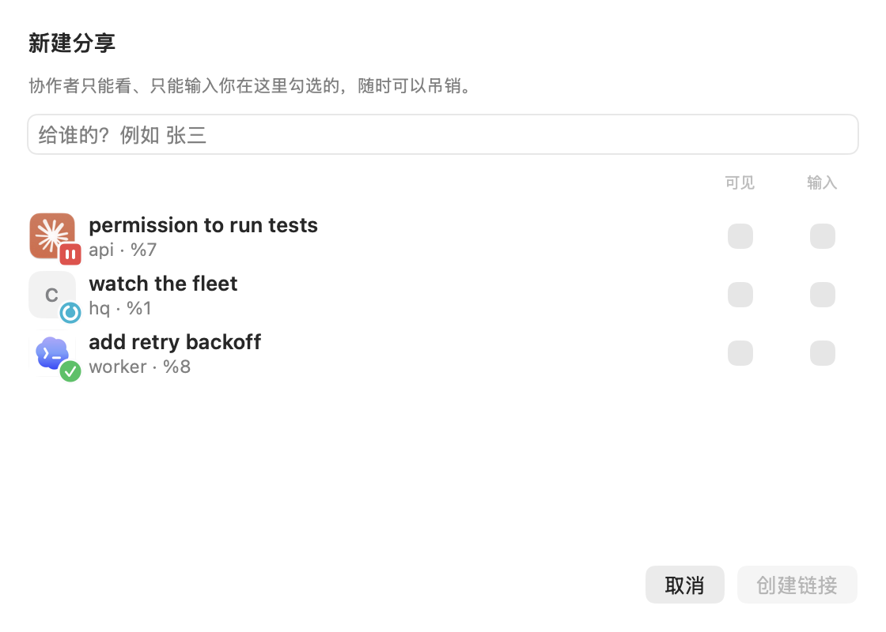

[English](phone-and-web.md) · **中文**

离开 Mac，也能用 iPhone／iPad 查看 agent、回复请求、和 HQ 对话。浏览器也能查看雷达、向 pane 输入。

## 先选 Pair 还是 Share

| 你想做什么 | 用哪个 | 权限 |
|---|---|---|
| 连接自己的 iPhone、iPad 或浏览器 | **Pair（配对）** | Mac 的 owner 权限，包括 HQ 和分享管理 |
| 让别人查看或协助一项任务 | **Share（分享）** | 只开放你选的 pane，可设为只读或允许输入 |

**自己的设备用 Pair；给协作者发 Share 链接。**

## 配对 iPhone 或 iPad

从 [App Store](https://apps.apple.com/app/id6791144062) 安装 gtmux。同一个 app 适用于两种设备，连接和使用时 Mac 要保持唤醒。

1. 在 Mac 菜单栏 app 打开「**偏好设置 → 远程访问**」。同一局域网内、设备之间能互通时选「**局域网**」；需要跨网络使用时选「**任意网络**」，按提示开启。
2. 在菜单栏打开「**配对设备…**」，显示配对二维码。
3. 在 iPhone／iPad 点「**添加服务器 → 扫描配对二维码**」，扫描它。

Mac 会出现在 app 的服务器列表里，打开后就是雷达。配对码只能用一次，每台设备生成新码。


也可以用终端：同一局域网运行 `gtmux serve`，跨网络运行 `gtmux tunnel`，再用 `gtmux pair` 获取二维码。

### 配对浏览器

用 `gtmux pair` 生成新码，打开它给出的浏览器链接。这个浏览器会成为你自己的已配对设备，可以查看雷达、向终端输入。别人需要访问时，请用 Share。

## 在 app 里操作

**iPhone：** 点一个 agent，查看对话或终端。需要回复时，点它给出的选项，或输入自己的回答；也能发控制键和截图。

在终端顶部点显示图标，可调整字号，或选择「**适应屏幕**」（默认）／「**保留排版**」。
前者按屏幕宽度折行；后者保留 Mac 的行宽，可左右滚动，适合看表格和代码差异。
外接大屏上的 tmux 窗格较宽时，行也会较宽；缩小窗格后，旧历史仍可能保留宽行。这个设置不会改变 Mac 窗格。
全屏时先退出全屏再调整。对话正文可用对话模式，Codex 截断的吸顶提示另有全文入口。


**iPad：** 宽窗口下，雷达在侧栏，选中的会话在旁边主区显示，点另一行即可切换。窄窗口使用 iPhone 的布局。


打开 **HQ** 可以查看对话、态势板和知识库；点服务器名称可以切换 Mac。在已配对的 Mac 上点「**新建会话**」，会打开一个 shell 终端，再从那里启动 agent。

想在 agent 等你或跑完时收到通知，请允许 iOS 通知。Mac 要醒着、serve 要运行，送达还受网络和通知设置影响。访客连接不接收这些通知。

## 把一个 pane 开给协作者

在 Mac 菜单栏 app 打开「**偏好设置 → 分享 → 新建分享…**」。填一个名称，勾选对方「**可见**」的 pane，只在需要对方回复的 pane 上勾「**输入**」。创建链接后发给对方，对方可在浏览器打开，或在 iOS app 中兑换。



允许输入时，还要在分享设置里开启访客输入总开关。只读链接不需要输入权限；访客看不到 HQ 页面和 owner 管理功能。

终端里创建一个 24 小时后过期的只读链接：

```sh
gtmux share new --label alice --view %7 --expires 24h
```

把 `%7` 换成要分享的 pane（`gtmux panes` 可查看编号）。要让对方回复，创建时加上 `--type %7`，并开启 `gtmux share on`。能输入的访客可以操作 pane 里的程序，权限与程序本身相同。

## 结束访问

任务结束后，在分享设置中吊销访客链接，或用 `gtmux share revoke <id>`。已配对手机的「**设置 → 分享与配对**」也能管理访客链接。

自己的设备丢失时，要在 **Mac 上**吊销：`gtmux devices` 查看设备 ID，`gtmux devices revoke <id>` 移除访问权限。配对码和分享链接都不要公开。

---

选择连接方式或排查问题：[远程访问参考](../phone.zh.md)。想在另一台电脑上直接用终端：[从任意电脑接回会话](attach-from-anywhere.zh.md)。完整参数：[Pair](../cli.zh.md#gtmux-pair接入你自己的设备全权) · [Share](../cli.zh.md#gtmux-share给协作者的受限可吊销访问)。

## 区分已配对的设备

在 Mac **偏好设置 → 我的设备 · 配对** 中，点击设备旁的铅笔编辑名称。
例如，把两台 iPhone 分别标记为工作手机和个人手机。这只是 gtmux 中的显示名称，
不会修改设备的系统名称，也不需要重新配对。App 的已配对设备列表会显示同一名称。

iOS 通常只提供 iPhone/iPad 这样的通用名称。读取“ccy's iPhone”这类用户设定的名称，
需要 Apple 授予专门权限；gtmux 不会假设已经获得这项权限。浏览器统一显示为
**Browser**，并在可获取时显示浏览器名称、主版本和系统。这些是客户端信息，
不能用来确定硬件型号。旧设备若显示**暂无客户端信息**，重新连接后会更新，无需重新配对。
