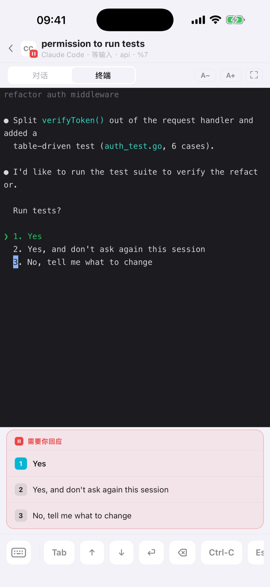
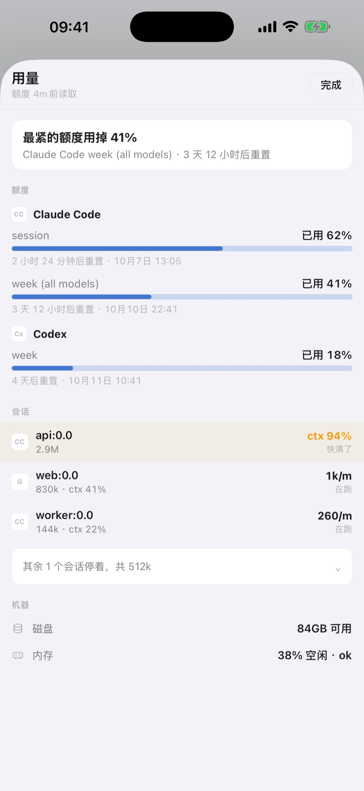
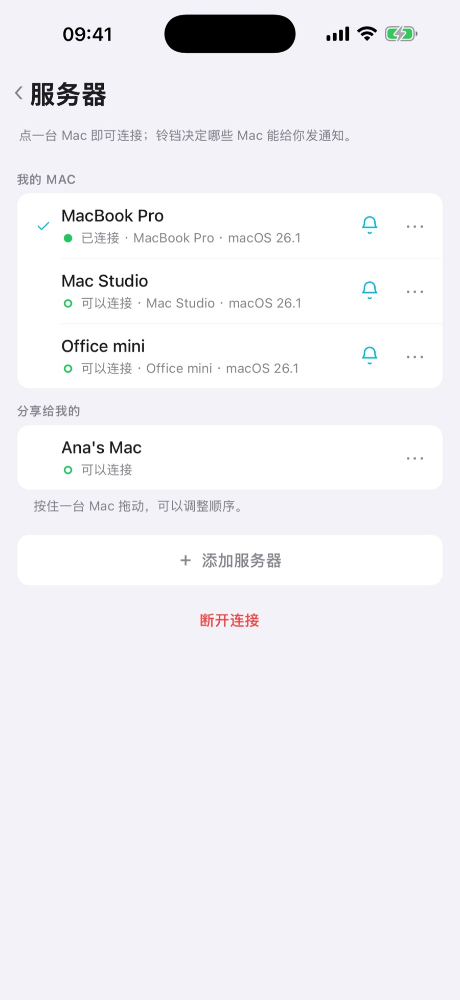

[English](phone-and-web.md) · **中文**

一轮 agent 跑半小时，你不必守着。这篇做两件事：把你自己的手机和浏览器配上 Mac，在哪都能看、能回、能收通知；再把某一个会话临时开给协作者，权限攥在你手里。

## 在 Mac 上开门

```sh
gtmux serve                # 手机和 Mac 在同一个局域网
gtmux tunnel               # 走出站隧道，给 Mac 一个公网 HTTPS 地址
```

同一个网络里 `serve` 就够。出了门用 `tunnel`，Mac 会有一个 `https://…` 地址，不用开路由端口，也不用 VPN；需要时它会顺手起 `serve`，`gtmux tunnel --service` 让它重启后也一直开着。两端的网络仍得允许这条连接：有些公司 Wi-Fi 会挡标准隧道。

不想开终端：在菜单栏 app 里点 gtmux 图标 → ⚙︎ → 偏好设置… → 远程访问。同样是三档（关闭 / 局域网 / 任意网络），选任意网络时再挑连接方式：标准（免费，走 Cloudflare 的网络）或直连（经 gtmux 自己的服务器走 443 端口，用访问码解锁，给挡了标准隧道的网络用）。开着时会显示可访问的地址。

隧道、Tailscale、自托管和安全边界的完整说明见[移动端与远程访问](../phone.zh.md#从任意网络gtmux-tunnel推荐)。

## 配上你的手机

```sh
gtmux pair
```

它把一个配对码印成三种形式：给手机扫的二维码、给浏览器的链接、给另一台电脑终端的 `gtmux attach` 命令。在 iOS app（[App Store](https://apps.apple.com/app/id6791144062)）里点「添加服务器」→「扫描配对二维码」。菜单栏的 ⚙︎ → 配对设备… 也能给出配对二维码，远程访问没开的话会先帮你打开。

之后手机上是一整套：

- 雷达，颜色和排序与 Mac 上一样；
- 每个会话的实时屏幕，可以回话、发控制键、发截图；
- agent 要授权时的 `1 / 2 / 3` 卡片；
- agent 等你或跑完时的锁屏通知；
- HQ 页，以及一张用量表：订阅窗口还剩多少、每个会话的上下文；
- 多台 Mac 放在一个列表里，点一下就切换，小铃铛决定哪几台能给你发通知。

通知经 gtmux 的推送中继和 Apple 的推送服务送达，所以 Mac 得醒着、`gtmux serve` 得在跑，手机的通知设置也得允许。

这是你自己的设备：全权，和坐在 Mac 前一样。





## 或者用浏览器，什么都不装

配对码只能用一次，手机刚刚用掉了。再跑一次 `gtmux pair`，把新输出里的浏览器链接在任何浏览器里打开：借来的笔记本、公司的 Windows 电脑、平板都行。你会看到雷达和每个 pane 的屏幕，也能往 pane 里打字。

## 把一个会话开给协作者

```sh
gtmux share new --label alice --view %7 --type %7 --expires 24h   # 访客链接：能看、能输入这个 pane，24 小时后失效
gtmux share on                                                    # 总开关：允许访客输入
gtmux share set <id> --type %7,%8                                 # 事后改某一条链接
gtmux share revoke <id>                                           # 用完：此后这条链接的请求一律被拒
```

- `--view` 是对方能看的 pane，`--type` 是能输入的 pane，后者也会自动加进可看范围。`--expires` 按分钟、小时或天写（`45m`、`24h`、`7d`），不写就不过期。
- 输入还要过总开关 `gtmux share on`，它默认是关的。
- 对方在浏览器里打开链接，或者在 iOS app 里兑换，都只是访客：只看得到你列出的 pane，碰不到 owner 设置，也碰不到 HQ。
- `share revoke` 之后，这条链接的下一个请求就会被拒。

能输入的访客，是在用那个 pane 里的 shell 或 agent 干活，权限就是那个程序本身的权限。分享范围决定的是哪几个 pane，管不了 pane 里的程序能做什么。

链接也能在菜单栏的「偏好设置 → 分享」里管，或者在已配对手机的「设置 → 分享与配对」里管。

## 安全

- 配对码只能用一次，5 分钟过期。
- **配对后设备的凭据就是密码。** 手机丢了，就在 Mac 上跑 `gtmux devices` 找到它的 ID，再 `gtmux devices revoke <id>`。要尽快：吊销之前，那台设备仍能往 pane 里输入，还能签发新的配对码。
- 吊销设备、开关远程访问都在 Mac 上操作，手机上的页面不提供，访客更看不到。
- 访客和你自己的设备是两条线：`pair` 全权，`share` 受限。访客不能注册通知，也不能用 `gtmux attach`。
- 别把配对二维码或分享链接发到公开的地方。

旧版本留下的、找不到归属的推送注册会保留但暂停；[`gtmux devices --push`](../cli.zh.md#gtmux-devices---push----forget-push查看与清理推送-token) 列出它们，`--forget-push` 清掉。



---

接下来：想在另一台电脑上直接用终端？[从任意电脑接回会话](attach-from-anywhere.zh.md) · 全部参数：[`gtmux share`](../cli.zh.md#gtmux-share给协作者的受限可吊销访问) 和 [`gtmux pair`](../cli.zh.md#gtmux-pair接入你自己的设备全权)
