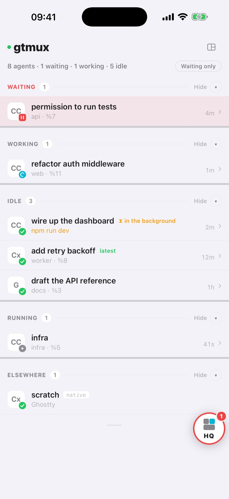

**English** · [中文](watch-a-fleet.zh.md)

You have five coding agents going at once: one refactoring, one running tests, one
writing docs, spread over a dozen tmux windows. What you lose track of is which one has
stopped to wait for you. This guide sets up the radar that shows it at a glance.

## Run each agent in its own tmux pane

The radar scans tmux panes, so an agent has to run inside tmux to be seen, jumped to and
replied to. (Outside tmux, an agent with the gtmux hook is listed read-only.) Start a named
tmux session and the agent inside it, one agent per pane. After installing and signing in
to the agent CLIs:

```sh
tmux new -s api 'claude'
```

Detach with `Ctrl-b d`, or open another terminal window, before starting the next one:

```sh
tmux new -s docs 'codex'
```

Why tmux: its sessions persist. Close the terminal, drop the SSH connection, unplug the
display, and the agent keeps running. Each agent has its own name and pane, so you can
find it and tell it apart. After a reboot, `gtmux restore` rebuilds the sessions and their
layout from the last saved tmux-resurrect snapshot; the programs come back as new
processes, and by default an agent whose conversation can be recovered picks it up again.
`gtmux doctor` sets up the saving. Closing a MacBook's lid still puts the whole machine to
sleep, agents included; `gtmux awake on` keeps it running with the lid shut. New to tmux?
The official [Getting Started](https://github.com/tmux/tmux/wiki/Getting-Started) covers
what you need.

## Put your agents on the radar

gtmux recognises agents in tmux from their command, title and process tree, so they appear
without any setup. A hook (a small callback the agent runs at each turn) adds exact turn
and approval state. Install it once per agent:

```sh
gtmux install hooks --agent claude
gtmux install hooks --agent codex
```

Without `--agent` it sets up Claude Code only. Repeat for the agents you use: `gemini`,
`cursor`, `opencode`, `kimi`, `copilot` or `kiro`. An agent that was already running picks
the hook up after a restart. `gtmux doctor --fix` offers the hook for Claude Code, and for
Codex and Kimi Code when it finds them; the others need the command above.

An agent without a hook still shows up: gtmux reads its state from the pane title and from
screen and CPU sampling, with less detail (a live Codex approval menu still shows as
waiting). Only an agent running outside tmux needs the hook to be seen at all.

## Open the radar

```sh
gtmux agents --watch      # a live dashboard in your terminal; ↑/↓ select, Enter jumps
```

Or keep it in view: the menu-bar app (installed by the install script, or
`brew install --cask chenchaoyi/tap/gtmux-app`) shows a status dot, opens a palette with
`⌘⌥G`, and posts a notification when an agent needs you. The iPhone and iPad app shows the
same radar. See [Manage from your phone and the web](phone-and-web.md).



## Read it

One colour language, the same in the terminal, the menu bar, the phone and the browser:

| Colour | Mark | State |
|---|---|---|
| red | `‖` | **waiting on you**: a permission, a plan or a question |
| cyan | `⠿` | working; leave it alone |
| green | `✓` | idle: it finished its turn, your move when you are ready |
| grey | `●` | an agent process whose turn state is not known |

Waiting rows sort to the top, so the red ones are what you are looking for. `latest` marks
the agent that finished most recently, and an amber `⚠` marks one whose turn ended on an
API or tool error.

To see everything else in tmux too (shells, editors, dev servers), `gtmux panes` lists
every pane, agent or not. The apps call it All panes.


## Jump to the one that is waiting

```sh
gtmux focus %7            # bring that pane's window and pane to the front
```

Or click its row in the menu-bar popover, or the notification. gtmux brings the terminal
window and pane forward with the cursor where the agent stopped; you answer, and it carries
on. Jumping works with Ghostty 1.3+, iTerm2 and cmux, and Warp on a best-effort basis, and
it needs tmux's `set-titles` option, which `gtmux doctor` sets
([`gtmux focus`](../cli.md#gtmux-focus)).

---

Next: too many agents to watch yourself? [Let HQ watch the fleet for you](hq-supervisor.md)
· Away from the desk? [Manage from your phone and the web](phone-and-web.md) · Every
command: [the CLI reference](../cli.md#gtmux-agents)
