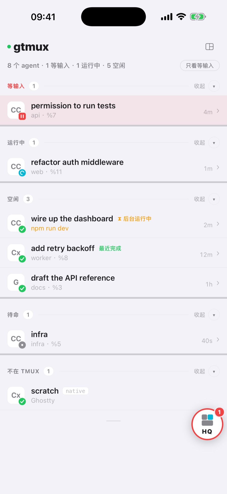
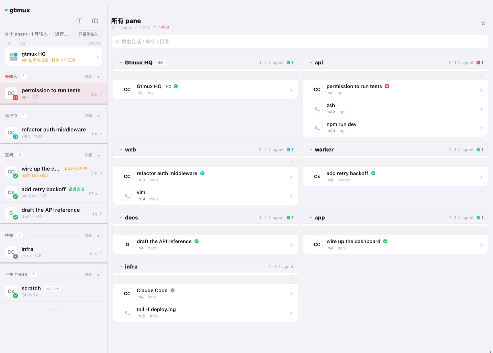

[English](watch-a-fleet.md) · **中文**

你同时开着五个 coding agent：一个在重构，一个在跑测试，一个在写文档，散在十几个 tmux 窗口里。最容易丢的，是哪一个停下来在等你。这篇把雷达搭起来，让你一眼看出来。

## 每个 agent 跑在自己的 tmux pane 里

雷达扫的是 tmux pane，agent 得跑在 tmux 里才看得到、跳得过去、回得了话。（tmux 之外的 agent 装了 gtmux hook 也能看到，但只读。）先开一个有名字的 tmux 会话，再在里面启动 agent，一个 agent 一个 pane。装好并登录 agent CLI 后：

```sh
tmux new -s api 'claude'
```

按 `Ctrl-b d` 脱离这个会话，或者另开一个终端窗口，再起下一个：

```sh
tmux new -s docs 'codex'
```

为什么用 tmux：它的会话是持久的。终端关了、SSH 断了、显示器拔了，agent 都还在跑；每个 agent 有自己的名字和 pane，找得到也认得出。重启后，`gtmux restore` 从最近保存的 tmux-resurrect 快照重建会话和布局，程序是重新起的进程；默认情况下，能恢复对话的 agent 会接着原来的对话。保存机制由 `gtmux doctor` 配好。MacBook 合盖仍会让整机休眠，agent 也跟着停；`gtmux awake on` 让它合盖后继续跑。没用过 tmux？官方的 [Getting Started](https://github.com/tmux/tmux/wiki/Getting-Started) 够用了。

## 让 agent 上雷达

gtmux 从命令、标题和进程树认出 tmux 里的 agent，不用任何配置就会出现在雷达上。hook（agent 每个回合调用的一小段回调）再补上准确的回合和审批状态。每种 agent 装一次：

```sh
gtmux install hooks --agent claude
gtmux install hooks --agent codex
```

不加 `--agent` 只配 Claude Code。你用哪些就接着配哪些：`gemini`、`cursor`、`opencode`、`kimi`、`copilot` 或 `kiro`。已经在跑的 agent 重启后才会用上 hook。`gtmux doctor` 也会主动提出给它找到的 agent 配好。

没装 hook 的 agent 照样上雷达：gtmux 从 pane 标题和屏幕、CPU 采样读状态，细节少一些（Codex 正在弹的审批菜单仍会显示为等待）。只有跑在 tmux 外面的 agent 必须装 hook 才看得到。

## 打开雷达

```sh
gtmux agents --watch      # 终端里的实时看板；↑/↓ 选择，回车跳过去
```

或者让它常驻：菜单栏 app（安装脚本会一起装，也可以 `brew install --cask chenchaoyi/tap/gtmux-app`）在菜单栏放一个状态点，`⌘⌥G` 唤出面板，有 agent 等你时发通知。iPhone 和 iPad app 上是同一块雷达，见[用手机和网页远程管理](phone-and-web.zh.md)。



## 看懂雷达

终端、菜单栏、手机、浏览器，一套颜色：

| 颜色 | 记号 | 状态 |
|---|---|---|
| 红 | `‖` | **在等你**：授权、计划或提问 |
| 青 | `⠿` | 在干活，别管它 |
| 绿 | `✓` | 空闲：这一回合跑完了，你方便时再看 |
| 灰 | `●` | 认出了 agent 进程，但还不知道回合状态 |

在等你的永远排在最上面，红色那几行就是你要找的。「最近完成」标出最近一个跑完的 agent，琥珀色 `⚠` 表示这一回合结束在 API 或工具报错上。

想连 tmux 里其他东西也看到（shell、编辑器、开发服务器），`gtmux panes` 会列出每一个 pane，不管是不是 agent。app 里它叫「所有 pane」。



## 跳到在等你的那个

```sh
gtmux focus %7            # 把那个 pane 所在的窗口和 pane 带到最前
```

或者点菜单栏面板里那一行，或者点通知。gtmux 把终端窗口和 pane 带到前面，光标就在 agent 停下的地方；你回一句，它接着干。跳转支持 Ghostty 1.3+、iTerm2 和 cmux，Warp 尽力支持，还需要 tmux 的 `set-titles` 选项，`gtmux doctor` 会帮你设好（[`gtmux focus`](../cli.zh.md#gtmux-focus)）。

---

接下来：agent 多到自己盯不过来？[让 HQ 替你盯全局](hq-supervisor.zh.md) · 不在电脑前？[用手机和网页远程管理](phone-and-web.zh.md) · 全部命令：[CLI 参考](../cli.zh.md#gtmux-agents)
