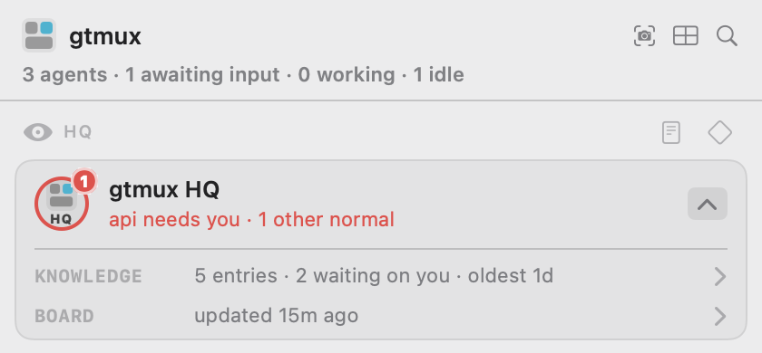

# What HQ remembers

**English** · [中文](knowledge.zh.md)

HQ is the supervisor session `gtmux hq` starts. As it watches your agents it learns
things: that this office network resets TLS handshakes, that a command in this repo needs
a flag nobody remembers, that you asked twice for links to be plain URLs. Those go into a
knowledge base on your Mac. Selected machine-wide lessons can be promoted and synced
into supported agents' instruction files, where new sessions can read their index.

This page covers where that base sits, how a lesson gets from "HQ noticed it" to "every
agent on this machine reads it", and what you can change yourself. Nothing here leaves
your machine unless you send it somewhere.

## Where it lives

Everything HQ owns is under `~/.config/gtmux/hq/`, and one generated file sits outside it:

| Path | What it is | Who writes it |
|---|---|---|
| `hq/knowledge/.ledger.jsonl` | the knowledge base itself: every entry, every change, append-only | HQ, through `gtmux knowledge …` |
| `hq/knowledge/*.md` | the same entries rendered by topic, for reading | gtmux, overwritten on every render |
| `hq/knowledge/promotions/` | the take-away brief of an entry waiting to be carried somewhere | gtmux |
| `hq/knowledge/tools/` | scripts HQ wrote for itself, each named by one entry | HQ |
| `hq/AGENTS.md` | HQ's charter: how it works, shipped with gtmux | gtmux, replaced on update |
| `hq/LOCAL.md` | your own standing rules | you; ordinary updates preserve it. HQ-targeted landing can append a section, and an explicit restore or migration can replace it |
| `hq/notes/board.md` | HQ's current picture of the fleet, not knowledge | HQ |
| `knowledge/machine.md` | the handful of lessons every agent on this machine must know | gtmux, generated |

Two of those folders are called `knowledge`, but they serve different readers.
`hq/knowledge/` holds HQ's complete ledger; it is not automatically loaded into ordinary
project sessions. That is a distribution boundary, not filesystem isolation: an agent
with access to those files can read them when directed to them.

The normal machine-wide distribution path uses supported agents' global instructions,
such as `~/.claude/CLAUDE.md` for Claude Code. The generated index points at `machine.md`
for the selected lessons, rather than loading HQ's whole base into every session.

The cost of not having it is easy to see. On a machine where `rm` is aliased to the
interactive version, an agent that runs it in a non-interactive shell fails silently: the
command looks like it ran and the file is still there. Recorded in the knowledge base
alone, that lesson stops nobody, because a new session is not automatically given that entry.
Carried out to `machine.md` and into each agent's instruction file, it is in front of
new sessions using the synced instruction file from their first turn.

Most entries never travel this way. They are about how HQ itself works, and hundreds of
them in every agent's context would crowd out the work, so this list stays short: a few
entries out of hundreds. Delete `machine.md` and the next sync writes it again.

## Three layers, and which one is yours

Rules reach an agent from three places, and they are not interchangeable:

| | HQ's charter `AGENTS.md` | Your rules `LOCAL.md` | This machine's base `knowledge/` |
|---|---|---|---|
| Whose it is | gtmux's | yours | this machine's |
| Who writes it | the product, shipped with each release | you | HQ, as it works |
| When it applies | every session | every session | when it is relevant, or when HQ looks it up |
| Can you edit it | no, it is regenerated | yes, this is the place for that | through the commands below, not by hand |

`LOCAL.md` is imported at the end of the charter, so what you write there extends and
overrides what gtmux ships. If you want HQ to always do something, write it there. If you
want it to remember something it worked out, that is the base.

## How a lesson travels

```
something happens  →  HQ records an entry  →  (optional) promote  →  land
```

HQ writes an entry the moment it learns something durable: what happened,
how to tell it is happening again, what to do. Any agent can drop a one-line candidate
with `gtmux capture "<lesson> @<topic>"`; HQ decides what becomes an entry. Once a day
gtmux also reads the agents' session logs, with no model involved, and queues the places
where you corrected someone or a tool failed repeatedly.

Most entries stay where they are. An entry stops being about this machine
when it is about you, about every agent here, about one repository, or about gtmux
itself, and HQ promotes it, saying who must know:

| Audience | Who reads it | Where it lands |
|---|---|---|
| HQ | HQ only | a section appended to your `LOCAL.md` |
| this machine | every agent on this Mac | `knowledge/machine.md`, plus a short block in each agent's global instruction file |
| a repository | agents working in that repo | a block in that repo's `AGENTS.md` (or existing `CLAUDE.md` when no `AGENTS.md` exists), written but never committed |
| everyone | all gtmux users | a pre-filled GitHub issue for you to open |

Promotion writes a brief. `land` without `--ref` carries it to the selected local
audience; `land --ref` records where you have already carried it. The common case is
"this machine": your Claude Code, Codex, OpenCode and Kimi Code each get a block naming
the lessons and pointing at the full text, so a fresh session knows them without anyone
pasting anything. `gtmux knowledge carriers` shows each agent's file
and whether it is current; `gtmux doctor --fix` repairs a stale one.

When an entry no longer applies, use `retire` with a reason. The ledger keeps the change.

## When machine instructions are synced

Landing an entry for "this machine" generates `~/.config/gtmux/knowledge/machine.md`
and refreshes the short index block in the global instruction files for Claude Code,
Codex, opencode, and Kimi Code. Ordinary entries stay in HQ's knowledge base; they do
not automatically enter every agent's instructions. Installing gtmux or running
`gtmux update` does not perform this sync. After an upgrade, run
`gtmux knowledge sync` if the blocks are stale, or use `gtmux doctor --fix` to check
and approve a repair. `gtmux knowledge carriers` lists the supported files and status.
The new index block also includes a short `gtmux relay` entry point supplied by gtmux;
it is not a knowledge entry promoted by HQ.

Sync changes only the text between the `gtmux:knowledge` markers and preserves text
outside the block. If someone edited the block by hand, sync refuses to overwrite it
unless you review it and use `gtmux knowledge sync --force`. Agents read their global
instructions when a new session starts; a running session does not reload them after
a sync. Other agent types currently have no global knowledge distribution channel.

## Reading it and changing it

On the phone and iPad, open HQ and tap **Knowledge**.


The knowledge list shows what is waiting on you first. Open an entry to read it.


In the menu bar, expand the HQ card and click its **KNOWLEDGE** row to open the same list.



From the terminal:

```sh
gtmux knowledge list                 # every live entry
gtmux knowledge list --topic pitfalls
gtmux knowledge show <id>            # one entry in full
gtmux knowledge lint                 # issues and clearly labeled review/info hints; never edits
gtmux knowledge carriers             # which agents have the machine block, and is it current
gtmux knowledge promotions           # what is promoted and waiting to be carried
```

Changing it is HQ's job and those verbs are its tools. Three of them you may want
yourself:

```sh
gtmux knowledge retire <id> --why "the office network was fixed"
gtmux knowledge sensitive <id> --confirmed "<your own words>"   # keep it on this Mac
gtmux knowledge sync                                            # push the machine block out again
```

The everyday way to change what HQ knows is to tell HQ, in its own session, and let it
write the entry. That keeps the reason, the provenance and the language halves intact,
which is the part a hand edit loses.

## Two languages

Every entry is written twice, in English and Chinese, each half written for that
language's reader rather than translated. Every surface shows you the half in your
language and marks the entry when only the other half exists. A missing half is a
counted backlog, never a reason not to record something.

## Your own information

You can ask HQ to keep something personal: an account you use, a path that is yours, a
preference. Those entries are marked sensitive, and gtmux treats the mark as a hard rule:
they are never rendered into `machine.md`, never written into a repository block, never
part of an exported brief, and every surface shows them with a lock. HQ only marks an
entry sensitive after you say so, in your words, and it records your words.

gtmux does not upload the knowledge base automatically. `gtmux hq --export` creates an
encrypted backup you can save or transfer; `gtmux hq --memory` reports its size. In the
menu bar, **HQ → Knowledge → Import…** offers two separate actions:

- **Restore HQ backup** restores the complete HQ home, including the old board, and
  retains the current home as a separate backup.
- **Move from another Mac** selects live knowledge and its revision history, personal
  requirements, or tool attachments for staging only. Nothing starts checked. The old
  board, sessions, pending leads, built-in rules and connection credentials do not move.

Review knowledge before applying it; sensitive histories need a separate opt-in and old
audience decisions are reset. Compare personal requirements side by side; keeping current
is the default, replacement is a separate decision. **Continue staged migration** resumes
a review after closing. Exit HQ before apply or restore; idle is still running.
The CLI equivalent is `gtmux hq migrate --help`; `--import` remains a complete restore.
See [Moving HQ](design/hq-move-between-macs.md) for exact rules and limits.

## If you want to read further

[docs/cli.md](cli.md) has every command and flag. The design behind it, including why the
layers are separate and what happens at each gate, is in
[docs/design/knowledge-layers.md](design/knowledge-layers.md).

## Sources and processing receipts

Each candidate now has an observation ID and payload digest; its family key still groups
related lines. Acceptance or dismissal commits all retained source text, context and
available metadata to the ledger before excluding those IDs from the pending view.
Validation or write failure keeps the work pending. New observations with the same key
remain pending. Dismissals retain their reason without becoming knowledge entries.

Use `gtmux knowledge show <id> --json` for entry sources and
`gtmux knowledge receipts --capture <key> --json` for committed acceptances/dismissals.
Supersede retains source lineage; receipts survive retirement. Unknown source positions
stay unknown, and sources already discarded by earlier versions cannot be recovered.
The digest detects changed payload bytes; it is not a truth score. Raw context stays out
of indexes, generated rules, agent instruction blocks and public promotion briefs.

Failures are reported directly and correlated by `op_id`, `outcome` and `phase` in
events/diagnostics when those logs are writable. If an error says the operation committed
but rendering failed, inspect its receipt and run `gtmux knowledge render`; do not accept
the same observations again. Writes share a process lock and replace the file only after
a complete temporary copy is ready, using space proportional to that file. Newly written
ledger/archive files are private. Use the current CLI for queue processing: older versions
may truncate the source archive under their former queue semantics.
