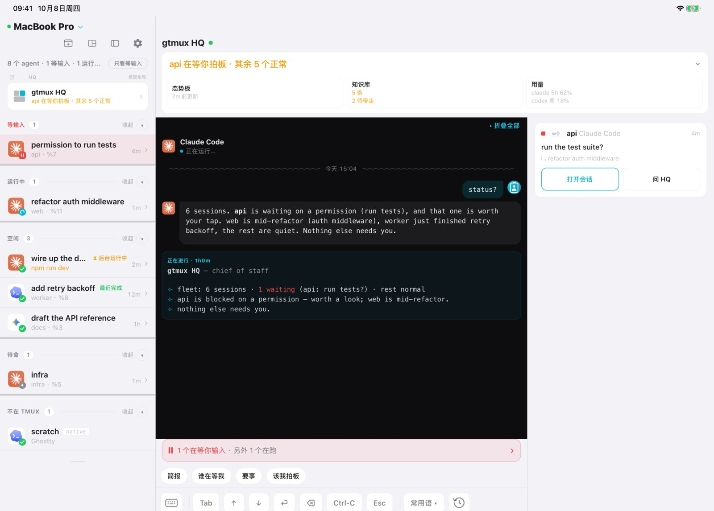
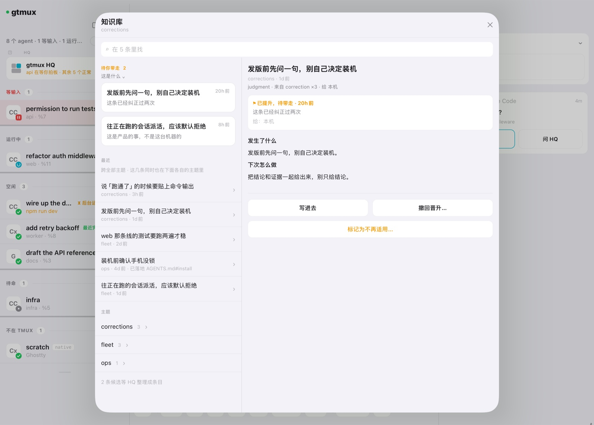
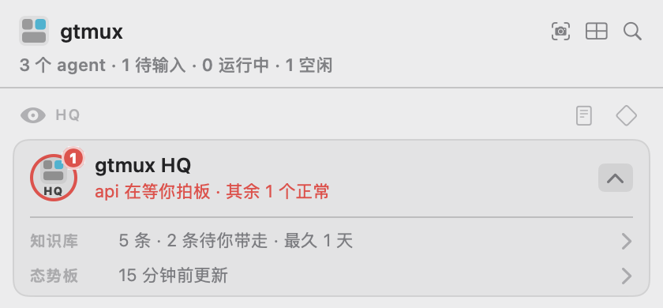

# HQ 记住的东西

[English](knowledge.md) · **中文**

HQ 是 `gtmux hq` 起的那个参谋会话。它盯着你的 agent 干活，顺手把学到的东西记下来：
这个办公网会掐 TLS 握手、这个仓库里某条命令得带个没人记得住的参数、你说过两次给链接
要原始 URL。这些进了你 Mac 上的知识库。选给本机共同使用的条目经过晋升和同步，会写入受支持
agent 的指令文件索引，新会话从那里查阅。

这页讲的就是它：东西存在哪，一条经验怎么从「HQ 注意到了」走到「这台机器上每个 agent
都读得到」，以及你自己能改什么。除非你主动往外发，这里的东西不出这台机器。

## 存在哪

HQ 的东西都在 `~/.config/gtmux/hq/` 下面，另有一个自动生成的文件在它外面：

| 路径 | 是什么 | 谁写 |
|---|---|---|
| `hq/knowledge/.ledger.jsonl` | 知识库本体：所有条目、所有改动，只追加 | HQ，通过 `gtmux knowledge …` |
| `hq/knowledge/*.md` | 同一批条目按主题渲染出来，给人读的 | gtmux，每次渲染覆盖 |
| `hq/knowledge/promotions/` | 已晋升、等着被带走的条目的交接简报 | gtmux |
| `hq/knowledge/tools/` | HQ 给自己写的脚本，每个都有一条条目指着它 | HQ |
| `hq/AGENTS.md` | HQ 的章程：它怎么干活，随 gtmux 发布 | gtmux，更新时整份换掉 |
| `hq/LOCAL.md` | 你自己的长期规矩 | 你维护，普通更新保留；面向 HQ 的条目落地可追加分节，明确执行恢复或迁移时可替换 |
| `hq/notes/board.md` | HQ 当前对舰队的判断，不算知识 | HQ |
| `knowledge/machine.md` | 这台机器上每个 agent 都该知道的那几条 | gtmux，自动生成 |

两个目录都叫 `knowledge`，但服务的读者不同。`hq/knowledge/` 保存 HQ 的完整台账，
不会自动装入普通项目会话。这是分发范围，不是文件权限隔离；能访问这些文件的 agent，
在得到路径或指示后也可以读取。

本机共同知识通常通过受支持 agent 的全局指令文件分发，例如 Claude Code 的
`~/.claude/CLAUDE.md`。生成的短索引指向 `machine.md` 中选出的条目，不会把 HQ 的整个
知识库装进每个会话。

没有它是什么代价，一个例子就够。本机把 `rm` 换成了会问一句 y/n 的版本，agent 在非交互
环境里执行它会静默失败：命令看起来跑过了，文件还在。这条教训只记在知识库里，拦不住任何人，
因为新会话不会自动拿到这条内容。推出去写进 `machine.md`、再进到各 agent 的配置里，它才会
出现在使用这份已同步指令的新会话中。

绝大多数条目不走这条路。它们讲的是 HQ 自己怎么干活，几百条全塞进每个 agent 的上下文只会
把正事挤掉，所以这份名单一直很短，几百条里挑出来几条。`machine.md` 删掉，下次同步会重建。

## 三层，哪一层是你的

规矩从三个地方到达一个 agent，三者不能互相顶替：

| | HQ 章程 `AGENTS.md` | 你的规矩 `LOCAL.md` | 本机知识库 `knowledge/` |
|---|---|---|---|
| 归谁 | gtmux 的 | 你的 | 这台机器的 |
| 谁写 | 产品写，随版本发 | 你写 | HQ 边干边写 |
| 什么时候生效 | 每次会话都在 | 每次会话都在 | 相关时才取，或 HQ 主动查 |
| 你能不能改 | 不能，它会被重新生成 | 能，这就是给你改的地方 | 走下面的命令，不要手改 |

`LOCAL.md` 在章程末尾被引入，所以你写在里面的东西会延伸并覆盖 gtmux 发的那份。想让
HQ 每次都照办的，写这儿；想让它记住自己摸索出来的，那是知识库。

## 一条经验怎么走完全程

```
出了点事  →  HQ 记成一条  →  （可选）晋升  →  落地
```

HQ 一学到能复用的东西就写一条：发生了什么、怎么认出它又来了、该怎么办。
任何 agent 都可以用 `gtmux capture "<一句教训> @<主题>"` 随手丢一条候选，由 HQ 判断哪些
成条目。gtmux 每天还会不用模型地读一遍各 agent 的会话日志，把你纠正别人的地方、以及
反复失败的工具调用排进同一个队列。

多数条目就待在原地。当一条经验不再只关于这台机器，而是关于你本人、关于
这里所有 agent、关于某个仓库、或者关于 gtmux 本身时，HQ 会晋升它，并说清给谁看：

| 读者 | 谁会读到 | 落在哪 |
|---|---|---|
| HQ | 只有 HQ 自己 | 追加进你的 `LOCAL.md` |
| 本机 | 这台 Mac 上每个 agent | `knowledge/machine.md`，外加各 agent 全局指令文件里一个短块 |
| 某个仓库 | 在那个仓库里干活的 agent | 仓库 `AGENTS.md` 中的块；没有它而已有 `CLAUDE.md` 时写后者，只写文件不提交 |
| 所有人 | 全体 gtmux 用户 | 一个填好的 GitHub issue，等你去开 |

晋升写好简报。不带 `--ref` 的 `land` 会把条目写到指定的本地读者入口；带 `--ref` 时，
则记录你已经把它带到了哪里。日常常用的是「本机」这一档：
你的 Claude Code、Codex、OpenCode、Kimi Code 各自的全局指令文件里都会有一个块，列出这几条
并指向全文，新开的会话不用谁去粘贴就知道。`gtmux knowledge carriers` 能看到每个 agent 的
文件和是否最新，`gtmux doctor --fix` 补上过期的。

条目不再适用时，可以用 `retire` 标记并写明原因；台账会保留这次变更。

## 本机指令什么时候同步

HQ 把面向「本机」的条目 `land` 时，gtmux 会生成 `~/.config/gtmux/knowledge/machine.md`，
并更新 Claude Code、Codex、OpenCode、Kimi Code 全局指令文件里的短索引块。普通条目只留在
HQ 知识库里，不会自动进入所有 agent 的指令。安装 gtmux 或运行 `gtmux update` 本身不会
执行这次同步；升级后如果索引块过期，运行 `gtmux knowledge sync`，或用
`gtmux doctor --fix` 检查并确认修复。`gtmux knowledge carriers` 会列出支持的文件和状态。
新版索引块还附有简短的 `gtmux relay` 入口说明，它由 gtmux 提供，不是 HQ 晋升的知识条目。

同步只改 `gtmux:knowledge` 标记之间的内容，保留块外文字；块内若被手工修改，默认拒绝覆盖，
核对后才使用 `gtmux knowledge sync --force`。全局指令由 agent 在新会话启动时读取，已运行
的会话不会因为同步而自动重新加载。其他 agent 类型目前没有这条全局知识分发通道。

## 怎么看，怎么改

手机和 iPad 上打开 HQ，点「**知识库**」。



知识库列表优先显示需要你处理的条目，点一条即可查看正文。



菜单栏里展开 HQ 卡片，点「**知识库**」那一行，打开同一份列表。



终端里：

```sh
gtmux knowledge list                 # 所有在库条目
gtmux knowledge list --topic pitfalls
gtmux knowledge show <id>            # 看某一条全文
gtmux knowledge lint                 # 体检：区分问题、复核候选和信息提示；从不替你改
gtmux knowledge carriers             # 哪些 agent 装了本机块，是不是最新的
gtmux knowledge promotions           # 已晋升、还等着被带走的
```

改是 HQ 的活，那些动词是它的工具。其中三条你可能会想自己用：

```sh
gtmux knowledge retire <id> --why "办公网已经修好了"
gtmux knowledge sensitive <id> --confirmed "<你自己的原话>"   # 只留本机
gtmux knowledge sync                                          # 把本机块重新推一遍
```

日常改 HQ 知道什么，最省事的办法是直接在 HQ 的会话里跟它说，让它自己写条目。这样理由、
出处和两种语言的两半都还在，手改丢掉的正是这些。

## 两种语言

每条条目都写两遍，中英各一半，各按各自语言的读者写，不是逐字翻译。各个界面都给你你那
半份，只有另一半时会标出来。缺一半只是一个待补的计数，绝不因此就不记。

## 你自己的信息

你可以让 HQ 记你个人的东西：常用的账号、只有你有的路径、某个偏好。这类条目会被标成敏感，
gtmux 把这个标记当硬规矩：不渲染进 `machine.md`、不写进任何仓库的块、不进导出简报，
每个界面上都带一把锁。HQ 只有在你说了之后才标，而且会把你的原话记下来。

gtmux 不会自动上传知识库。`gtmux hq --export` 可生成加密副本，由你自行保存或传输；
`gtmux hq --memory` 可查看占用空间。菜单栏 **HQ → 知识库 → 导入…** 提供两个独立入口：

- **恢复 HQ 备份**：还原整份 HQ 目录，包括旧态势板；当前目录另存为备份。
- **从另一台 Mac 迁移**：选择当前知识及修订历史、个人要求，或仅暂存工具附件。
  默认均不勾选；旧态势板、会话、待整理线索、内置规则和连接授权不迁移。

知识先进入核对界面，敏感历史需另行选择；核对后才应用，旧分发范围会清除。
个人要求并排核对，默认保留当前内容，替换需单独确认。中途关闭后可用
**继续核对暂存内容** 返回。应用或恢复前需退出 HQ，空闲也不算退出。
CLI 对应 `gtmux hq migrate --help`；`--import` 仍是整份恢复。
详细规则和限制见[换机迁移](design/hq-move-between-macs.zh.md)。

## 想再往下读

[docs/cli.zh.md](cli.zh.md) 里有全部命令和参数。背后的设计，包括三层为什么要分开、
每道闸各管什么，在 [docs/design/knowledge-layers.zh.md](design/knowledge-layers.zh.md)。

## 来源与处理回执

每次观察都有独立 ID 和内容摘要，同类线索仍用同一个 key 归组。采纳或驳回时，先将
保留下来的原文、上下文和可获得的来源信息提交到台账，再从待办视图排除这些 ID。
校验或写盘失败时，线索仍待处理；同一个 key 后来出现的新线索仍会进入队列。
驳回理由留在台账，但不会变成知识条目。

`gtmux knowledge show <id> --json` 提供条目来源；
`gtmux knowledge receipts --capture <key> --json` 提供已提交的采纳、驳回及其来源。
修订条目会沿用来源，条目退役后仍可查回执。缺失的来源位置表示未知；历史上已经丢弃的
来源无法补回。内容摘要用于检测文字是否改变，不代表事实可信度。原文上下文不会进入
索引、生成的规则、agent 指令块或公开推广简报。

失败由命令直接报告；日志可写时，事件和诊断日志还会用 `op_id`、`outcome`、`phase`
关联。若错误说明“已提交，但视图更新失败”，请先查回执，再执行
`gtmux knowledge render`，不要重复采纳。写入共用跨进程锁，完整的新文件就绪后才替换
原文件，临时空间与该文件大小相当；新写入的台账和来源档案仅允许当前用户访问。
请用当前版本处理队列，旧版本的队列清空逻辑可能截断来源档案。
