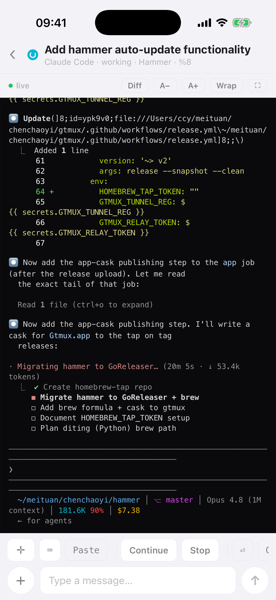
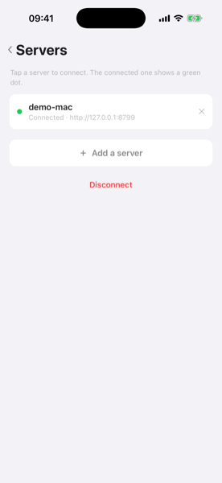

# Mobile & remote access



The third surface is an iOS app (`mobileapp/`, React Native): the same agent
radar in your pocket, with a lock-screen push the moment an agent needs you or
finishes. Read a pane's live screen in color, send a reply or a control key
(`Enter`, `Ctrl-C`, …), attach a screenshot — all gated by a bearer token. It
pairs with `gtmux serve` (HTTP+SSE over your network) and gets push over APNs.
Agents running outside tmux are sensed read-only under an **Elsewhere** section,
same as the menu bar (no jump/reply — they have no pane).

```sh
gtmux serve --port 8765          # prints a token + the reachable URL(s)
```

Then pair the app — scan the menu-bar app's pairing QR, or enter the host + token
manually. You can save several servers and switch between them from the
connection page (tap the server name in the radar header).

A **paired (owner) phone can manage sharing remotely** — a **Manage this Mac** screen
lets you mint, copy, and revoke the same scoped guest links as `gtmux share` (per-pane
view/type), plus see the paired-device roster, without walking to the Mac. Revoking a
paired device and toggling the remote-access door stay Mac-only (a lost phone can't
re-key the machine). A **guest** connection never sees this screen.



Two facts decide what you can do from where:

- **Push reaches you anywhere.** Alerts arrive over APNs on any network (cellular,
  home Wi-Fi), even when the phone can't reach the Mac — Mac at the office, you at
  home, you still get "needs you / finished".
- **The live view (radar / read a pane / focus) needs a network path to the Mac.**
  Same Wi-Fi works directly. Different networks need a tunnel (below).

## From anywhere — Tailscale (recommended)

A private mesh between your devices that ignores corporate Wi-Fi client isolation
and works office↔home.

1. **Mac:** `brew install --cask tailscale` (or the App Store), open it, sign in.
2. **iPhone:** install **Tailscale**, sign in with the **same account**.
3. Get the Mac's Tailscale address: `tailscale ip -4` (a `100.x.y.z`).
4. Pair the app to `http://<that-100.x.y.z>:8765` + the serve token. The live
   view now works from any network.

> **Same Wi-Fi can't reach the Mac?** Corporate/guest Wi-Fi often **isolates
> clients** (phone↔Mac blocked) — Tailscale fixes that. Quick check: open
> `http://<mac-ip>:8765/api/health` in the phone's browser; if it doesn't load,
> you need Tailscale (or a tunnel).
>
> **Mainland China:** Tailscale is a VPN-category app and is generally **not in
> the China App Store**. Install it with a non-mainland Apple ID, **or** skip the
> VPN app entirely with the tunnel below (the phone connects to a normal
> `https://…` URL — no VPN app needed).

## From anywhere — `gtmux tunnel` (no VPN app)

An **outbound** reverse tunnel on the Mac: it dials out to a rendezvous point, so
there's no inbound port to open and NAT is no problem. The tunnel client
(`cloudflared`) runs only on the Mac — the mobile app is unchanged (it still pairs
to a `{url, token}`).

```sh
gtmux tunnel                  # Standard: a STABLE hosted address — pair once
gtmux tunnel --backend self   # Direct: through gtmux's own server (paid; see --redeem)
gtmux tunnel --quick          # account-less ephemeral URL (changes each run)
gtmux tunnel --service        # keep it on across reboots (--unservice / --status)
```

It starts the read-only radar (if not already up), opens the tunnel, and prints
the public URL + the serve token + a scannable pairing QR — plus an **"open on
computer"** link to a read-only web mirror (view the radar and a pane in a browser,
no app). Open the mobile app → **Add a server → Scan** → connected from any network.
(Missing `cloudflared`? It offers to `brew install` it.)

**Anywhere comes in two flavors:**

- **Standard (default)** — a zero-config, free Cloudflare tunnel. Each Mac gets a
  stable `https://<id>.gtmux.ccy.dev` via gtmux's control plane, so the phone
  **pairs once** and keeps working across restarts. No account or domain on your side.
- **Direct (`--backend self`)** — a chisel tunnel through **gtmux's own server** over
  443, for networks that DNS-hijack or block Cloudflare's tunnel edge (some corp /
  China networks). It's a **paid unlock**: redeem your access code with
  `gtmux tunnel --redeem <code>` (or the menu bar's **Anywhere → Direct**, which
  prompts for one), then use `--backend self`. Direct is multi-tenant — each Mac gets
  its own address `https://tunnel.ccy.dev/p<port>`. (Running your OWN server instead?
  Point it with `GTMUX_SELFTUNNEL_URL` + `GTMUX_SELFTUNNEL_SECRET`; setup in
  `deploy/self-tunnel/`.)
- **`--quick`** — no infrastructure, but the `trycloudflare.com` URL **rotates each
  run** (re-pair every time). Fine for a quick look, not "leave it running and check
  later".

**Keep it on across reboots:** `gtmux tunnel --service` (or the menu-bar **Anywhere**
toggle) registers it as a background LaunchAgent; `--unservice` turns it off,
`--status` shows state.

**Self-host the control plane:** point `gtmux tunnel` at your own Worker with
`GTMUX_TUNNEL_API` / `GTMUX_TUNNEL_REG`. See `design/remote-access-tunnel.md` and
`../tunnel-worker/`.

## From another computer's terminal — `gtmux attach`

The phone app watches + drives; from another **Mac/Linux terminal** you can go
further and truly *attach* to a remote session and work in it:

```sh
gtmux attach http://<mac>:8765 --token <serve-token> %12   # owner (LAN or tunnel)
gtmux attach 'https://<mac>.example/#t=<token>' %12        # scoped guest (share link)
```

Your local Ghostty / iTerm2 / Terminal becomes the remote tmux session — raw,
interactive, full TUI fidelity — over the same serve/tunnel (a WebSocket, `GET
/api/attach`). It honors the SAME owner/guest scope as the web + phone: a guest is
restricted to the host's view/input allowlists (a view-only pane is read-only), set up
in the menu bar's **Sharing** section or with `gtmux share`. Detach with tmux `<prefix> d`
or `Ctrl-]`. Full reference: [`cli.md` → `gtmux attach`](cli.md) and
[`design/remote-attach-research.md`](design/remote-attach-research.md).

## Security

The remote surface is read-only **except `POST /api/send`** (terminal input via
`tmux send-keys`), and everything is gated only by the bearer token. With a public
tunnel URL, that token is the *only* gate (no VPN layer in front): no token → 401,
but **treat the URL + token like a password** — anyone who has both can type into
your Mac. Don't screenshot the pairing QR into a shared channel.

See `../api/contract.md` and `../mobileapp/SPEC.md` for the full protocol.
