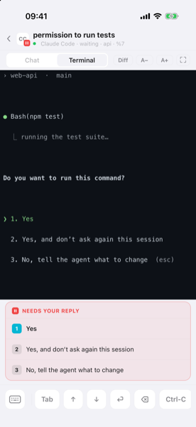
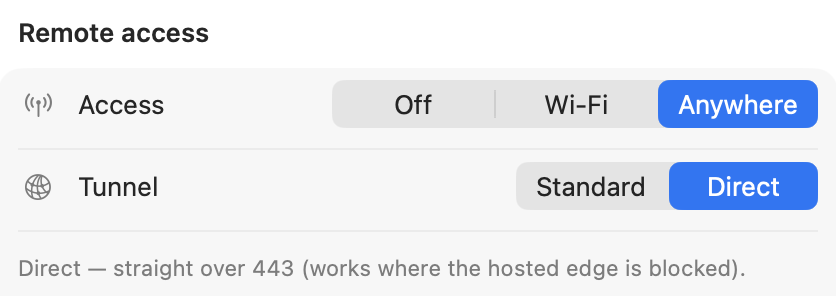
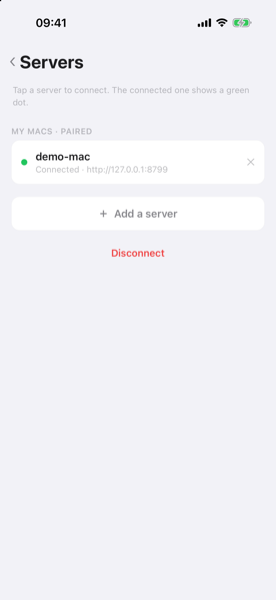

# Mobile & remote access

**English** · [中文](phone.zh.md)



gtmux has an iOS app: the same agent radar on your phone, with lock-screen notifications
when an agent needs you or finishes (subject to notification settings and delivery). You can read a pane's live screen in
color, send a reply or a control key (`Enter`, `Ctrl-C`, and so on), and attach a
screenshot. Agents running outside tmux appear read-only under an "Elsewhere"
section, as in the menu bar: they have no pane, so there is nothing to jump to or
reply into. A saved Codex conversation title appears on these rows when available;
otherwise the project or terminal name remains the label.

The app talks to `gtmux serve` on the Mac and receives push notifications through
Apple's notification service.

```sh
gtmux serve --port 8765          # prints a token + the reachable URL(s)
```

Then pair the app: run `gtmux pair` and scan the QR it prints (the menu-bar app
shows a pairing QR under ⚙︎ → Pair a device…), or enter the address and token by
hand. You can save several Macs and switch between them from the connection page
(tap the server name in the radar header).

## Create a session from the app

On a paired Mac, tap **New session** in the radar or **All panes** header. The form shows which Mac will create it. Enter an optional name, then tap **Create and open**. The app opens the new pane in Terminal; on iPad, it opens in the main area.

This starts the Mac's default shell in your home folder. It does not start an agent or bring a desktop terminal forward. You can start your chosen agent in that terminal, or use Focus to bring the pane to the Mac. Names containing `.` or `:` are shown with `-` before creation; an existing name asks you to choose another. Guest links cannot create sessions.

If the result is interrupted, **Retry** checks the same creation request instead of starting another live session. **Check sessions** lets you inspect the list first. An older Mac installation prompts you to update gtmux.

## No terminal needed: the menu-bar app has the same controls



Everything below about turning on remote access is also two clicks in the
menu-bar app: click the gtmux status icon, then ⚙︎ → Preferences… → Remote
access. That page has the same three-way switch (Off / Local network / Anywhere) and
the connection method under Anywhere (Standard / Direct); with Anywhere on, the **?**
beside Access shows the current address. ⚙︎ → Pair a device… shows the one-time pairing
QR/code directly; if remote access is off, it first asks you to choose Local network or
Anywhere and turn it on. The Sharing section in
Preferences manages the same guest links as `gtmux share`.

A paired phone (an owner device) can manage sharing remotely. Its Sharing & pairing
screen lets you create, copy and revoke the same guest links as `gtmux share`
(per pane: view, type) and shows the list of paired devices, without walking to
the Mac. Revoking a paired device and switching remote access on or off are managed
on the Mac, not from this screen. These UI limits do not contain a lost owner
device: its credential can still send terminal input and mint another pairing
code. Revoke a lost device on the Mac promptly. A guest connection never sees
this screen.



A Mac you paired yourself, running a gtmux that reports it, says what it is on its status
line once it answers, for example "Available · Studio · macOS 26.1", so a Mac you renamed
on the phone can still be told apart by its own name. **••• → Details** shows the rest: its
computer and host name, its system and build, chip, logical CPUs, memory, how long it has
been up, and the gtmux and tmux it runs, next to the name and address this phone keeps.
When those are missing it says why: a share link does not include them, the Mac's gtmux is
too old, the Mac no longer accepts this phone (pair again), or it could not be reached.

Two facts decide what works from where:

- Push does not need a direct phone-to-Mac connection. The Mac must be awake
  with `gtmux serve` running and able to reach its push relay; the phone must
  have registered for notifications and be reachable through Apple's notification
  service. Delivery can be delayed or blocked by network and notification settings.
- The live view (the radar, reading a pane, focus) needs a network path to the
  Mac. On the same local network it works directly. From a different network you need
  remote access, set up below.

## From anywhere: `gtmux tunnel` (recommended)

The Mac opens an outbound tunnel, so you do not need to forward an inbound port
to it. Its network must allow the selected tunnel service. Only the Mac runs the
tunnel client: `cloudflared` for Standard and quick tunnels, the built-in `chisel`
client for Direct. The phone opens a normal `https://…` address.

```sh
gtmux tunnel                  # Standard by default; reuses an active always-on tunnel
gtmux tunnel --backend self   # Direct: through gtmux's own server (paid; see --redeem)
gtmux tunnel --quick          # account-less ephemeral URL (changes each run)
gtmux tunnel --service        # keep it on across reboots (--unservice / --status)
```

`gtmux tunnel --status` shows the active tunnel type and address. Once Direct is
enabled, repeating `gtmux tunnel --service` keeps Direct; use an explicit
`--backend cloudflare` to switch to Standard. A pairing code is single-use. If
you change tunnel type or server before scanning, refresh the QR and scan the
current address. The phone saves its credential as soon as enrollment succeeds;
if its first radar load is slow, retry the connection without reusing the code.

It starts `gtmux serve` if needed and prints the public address and a pairing QR.
When it can mint a one-time code, the QR contains that code and the CLI offers a
`#c=` browser pairing link; it does not print the owner token. If minting fails,
it prints the owner token and puts it in a legacy QR. In that fallback, the bare
browser URL does not authenticate the browser by itself.

In the mobile app, go to Add a server → Scan. For a browser, obtain a fresh link
from `gtmux pair`, the tunnel command, or the menu bar’s Pair a device sheet; the
phone’s former “open on computer” handoff was removed. Paired owner browsers can
read panes and send input. The phone or browser must be able to reach the address;
a tunnel does not bypass every network restriction.
Standard and quick tunnels offer to `brew install` `cloudflared` if it is missing;
Direct does not need that binary.

Anywhere comes in two kinds:

- Standard (default): a free, zero-config tunnel. Each Mac gets a stable
  `https://gtmux-<label>.ccy.dev`, retained while the same registration is reused.
  Replacing a deleted tunnel gives it a new random label and requires re-pairing.
  No Cloudflare account or domain is needed on your side.
- Direct (`--backend self`): a tunnel over port 443 through gtmux's own server,
  for restrictive networks that block the Standard tunnel (some corporate
  networks). It is a paid unlock: get an access code at
  <https://ccy.dev/projects/gtmux/direct>, redeem it with
  `gtmux tunnel --redeem <code>` (or the menu bar's Anywhere → Direct, which
  prompts for one), then use `--backend self`. Each Mac gets its own address,
  `https://tunnel.ccy.dev/p<port>`, and its own account on the server, which can only
  ever reach that address; one code unlocks up to three Macs, and redeeming again on the
  same Mac is fine. There may be more than one Direct server: `gtmux tunnel --servers`
  lists them with the round trip measured from this Mac, and `gtmux tunnel --server <id>`
  moves this Mac to another one, keeping the same code and the same port. Phones that have
  connected to this Mac before follow a move on their own; a device that paired but never
  connected has to scan the pairing code again, and guest links minted before the move stop
  working. The menu bar marks the route saved on this Mac as current, even if the server
  directory briefly still names the previous route after a move. To run your own server
  instead, point at it
  with `GTMUX_SELFTUNNEL_URL` + `GTMUX_SELFTUNNEL_SECRET`; the setup lives in
  `deploy/self-tunnel/` in the repo.
- `--quick`: no setup at all, but the `trycloudflare.com` address changes on every
  run, so you re-pair every time. Fine for a quick look, not for leaving it
  running.

Keep it on across reboots: `gtmux tunnel --service` (or the menu-bar Anywhere
toggle) registers it as a background service; `--unservice` turns it off,
`--status` shows the state. A MacBook with its lid closed goes to sleep and the
tunnel drops with it. `gtmux awake on` keeps the Mac running with the lid shut so
an already configured serve and tunnel can keep answering; it does not start them.
On battery it warns at 30% and restores sleep at 20%. `gtmux awake off` needs no
password while its guard is installed; without the guard it asks for administrator
authorization. Closing requests are confirmed by reading the kernel state, and an
unreadable state is reported as unknown. See [`cli.md` → `gtmux awake`](cli.md).

Contributors who want to host the tunnel service themselves: `GTMUX_TUNNEL_API` /
`GTMUX_TUNNEL_REG` point `gtmux tunnel` at your own instance; see
[`design/remote-access-tunnel.md`](design/remote-access-tunnel.md).

## From anywhere: Tailscale or any VPN

If you already run Tailscale (or another VPN) between your devices, that works
too, and it also gets around corporate Wi-Fi client isolation. Install Tailscale
on the Mac (`brew install --cask tailscale`, or the App Store) and on the iPhone,
sign in with the same account on both, get the Mac's address with
`tailscale ip -4` (a `100.x.y.z`), and pair the app to `http://<that address>:8765`
plus the serve token. Nothing else changes.

> Same Wi-Fi, but the phone cannot reach the Mac? Corporate and guest Wi-Fi often
> isolate clients from each other. Quick check: open
> `http://<mac-ip>:8765/api/health` in the phone's browser; if it does not load,
> use `gtmux tunnel` (or a VPN).

## On an iPad: a sidebar beside the work

The same app, installed from the same App Store listing. On a window at least
768×600 points (any iPad orientation, a 2/3 Split View, a Stage Manager window that
size) the radar becomes a sidebar and whatever you open (a session, gtmux HQ, All
panes) fills the main pane beside it. Nothing is pushed; tap another row and the
main pane switches. Narrower than that (a 1/2 Split View, Slide Over) it is the
phone's layout.

- The sidebar hides with the button next to the gear, or ⌃⌘S, and remembers.
- Chat reads at a comfortable width; the terminal uses the whole pane.
- The HQ page shows its conversation and, beside it, what is waiting on you and what HQ did.
- HQ's knowledge base (the notes it has collected) opens its list beside the entry you are reading.

With a hardware keyboard, hold ⌘ to see the commands. The ones worth learning:

| Keys | What |
|---|---|
| ↑ ↓ ⏎ | move along the radar, open the selected session |
| ⌘1 … ⌘9 | open the nth row |
| ⌘⇧H · ⌘⇧P | gtmux HQ · All panes |
| ⌘F | search panes |
| ⌘K | type a message |
| ⌘[ · ⌘] | chat · terminal |
| ⌘= · ⌘− | text size |
| esc | close a sheet |

## Read the HQ situation board

Open HQ → Situation board to read its current overview and handover notes. Tap a section or entry to expand it. Pane rows show the task first, with the pane ID and location underneath; tap a row for labelled details. Long text has a Show full text button. Empty headings are hidden, and reading stays open when new entries arrive. The board is a recorded overview, not the live radar.

## From another computer's terminal: `gtmux attach`

The phone app watches and drives. From another Mac or Linux terminal you can go
further and work inside a remote session. Install the gtmux CLI there and use an
interactive terminal. Replace the placeholders below with the Mac's actual address
and credential, or copy the complete command from a fresh `gtmux pair`:

```sh
gtmux attach http://<mac>:8765 --token <serve-token> %12   # owner (LAN or tunnel)
```

Your local Ghostty / iTerm2 / Terminal becomes the remote tmux pane, fully
interactive, full-screen programs included, over the same connection the phone
uses. `gtmux pair` also prints a one-line `gtmux attach` command that enrolls that
terminal as one of your own devices, so later a bare `gtmux attach <host>` is
enough. A share link cannot open a terminal: a terminal would reach the whole tmux
session, not only the panes the host shared, so the serve refuses it. A guest opens
the link in a browser instead, where it sees and types into only the panes the host
allowed (a view-only pane is read-only). Set that up in the menu bar's Sharing section
or with `gtmux share`:

```sh
gtmux share new --label alice --view %1,%2 --type %1 --expires 24h   # one link with its own scope
gtmux share set <id> --type %2        # change one link
gtmux share revoke <id>               # cut it off
```

Detach with tmux's `<prefix> d` or `Ctrl-]`. Full reference:
[`cli.md` → `gtmux attach`](cli.md) and
[`design/remote-attach-research.md`](design/remote-attach-research.md).

## Security

Remote access has two roles: paired devices and guest links. Each paired device has
its own credential and can control the Mac and manage sharing. Guests can view or
type only in panes allowed by their link. A public tunnel address alone does not
grant access, but pairing codes, device credentials and share links should be kept
private. A guest who can type can operate the programs in that pane; pane scope
is not a sandbox for their filesystem or network access. Do not post a pairing
QR or share link in a public channel. You can revoke
a device or guest link on the Mac; guest typing also requires `gtmux share on`.

When something goes wrong, the phone has kept a record of it: failed requests to the
Mac, each pairing attempt and why it failed, push registration, and the live connection
dropping and coming back. It stays on the phone. Settings → Diagnostics lets you copy or
share it; on the Mac, `gtmux doctor --bundle` packs the other side.

Contributors can read the full protocol in `api/contract.md` in the repo.
