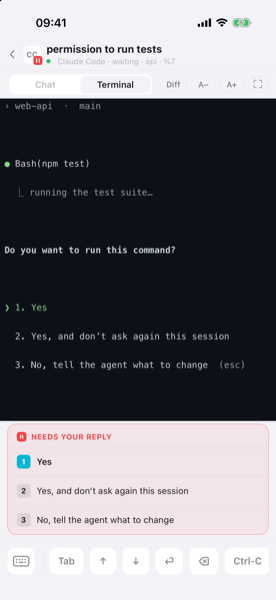
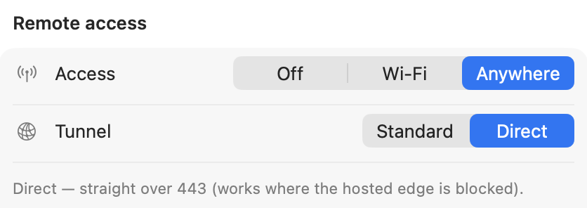
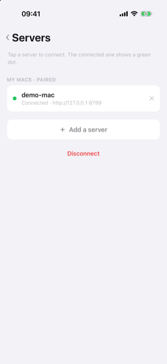

# 移动端与远程访问

[English](phone.md) · **中文**



第三块屏是 iOS app（`mobileapp/`，React Native）：同一块 agent 雷达装进口袋，
agent 需要你或者跑完的那一刻推到锁屏。可以彩色读一个 pane 的实时屏幕、回一句话、
发控制键（`Enter`、`Ctrl-C` 等）、附一张截图，全部由 bearer token 把关。它跟
`gtmux serve` 配对（局域网上的 HTTP+SSE），推送走 APNs。跑在 tmux 之外的 agent
和菜单栏一样，只读地列在 **不在 tmux** 分区里（没有 pane，所以不能跳、不能回）。

```sh
gtmux serve --port 8765          # 打印 token 和能连的地址
```

然后配对：扫菜单栏 app 里的配对二维码，或者手输地址 + token。可以存多台服务器，
在连接页切换（点雷达顶栏的服务器名字进去）。

## 不用开终端 —— 菜单栏 app 是同一扇门



这份文档里「开门」那半边，在菜单栏 app 里都是两次点击：点 gtmux 状态图标 → ⚙︎ →
**偏好设置 → 远程访问**，同一个三档开关（**关 / Wi-Fi / 任意网络**）、任意网络下的隧道后端
（**Standard / Direct**），开着的时候还会显示能连的地址。**⚙︎ → 配对设备…** 直接给你
一次性配对二维码/配对码（门没开的话，它会先带你把门打开）；偏好设置里的 **分享** 分区
管的就是 `gtmux share` 那套受限访客链接。

**配对过的（owner）手机可以远程管分享**：**管理这台 Mac** 页面能签发、复制、吊销
和 `gtmux share` 同一套的受限访客链接（按 pane 给看/给输入），也能看到已配对设备清单，
不用走回 Mac 前。**吊销一台已配对设备**和**开关远程访问的门**仍然只能在 Mac 上做
（手机丢了，捡到的人不能拿它给这台机器重新配钥匙）。**访客**连接看不到这个页面。



两件事决定你在哪儿能做什么：

- **推送到哪儿都收得到。** 告警走 APNs，任何网络都能到（蜂窝、家里 Wi-Fi），
  哪怕手机根本连不上那台 Mac。Mac 在公司、你在家，「需要你 / 跑完了」照样收到。
- **实时视图（雷达 / 读 pane / focus）需要一条能到 Mac 的网络路径。** 同一个 Wi-Fi
  直接就行；不同网络需要隧道（见下）。

## 从任意网络 —— Tailscale（推荐）

在你自己的设备之间搭一张私有网，绕开公司 Wi-Fi 的客户端隔离，公司↔家都通。

1. **Mac**：`brew install --cask tailscale`（或者 App Store），打开、登录。
2. **iPhone**：装 **Tailscale**，用**同一个账号**登录。
3. 拿到 Mac 的 Tailscale 地址：`tailscale ip -4`（一个 `100.x.y.z`）。
4. 把 app 配对到 `http://<那个 100.x.y.z>:8765` + serve token。实时视图从此在任何网络下可用。

> **同一个 Wi-Fi 也连不上 Mac？** 公司/访客 Wi-Fi 常常**隔离客户端**（手机↔Mac 被挡），
> Tailscale 能解决。快速确认：在手机浏览器里打开 `http://<mac-ip>:8765/api/health`，
> 打不开就说明需要 Tailscale（或者隧道）。
>
> **你所在区域的 App Store 没有 Tailscale？** 用下面的 `gtmux tunnel`，
> 手机只是打开一个普通的 `https://…` 网址，一个网格/VPN app 都不用装。

## 从任意网络 —— `gtmux tunnel`（不装 VPN app）

Mac 上的**出站**反向隧道：它主动拨出去到一个汇合点，所以不用开入站端口，NAT 也不是问题。
隧道客户端（`cloudflared`）只跑在 Mac 上，手机 app 什么都不用改（还是配对一组 `{url, token}`）。

```sh
gtmux tunnel                  # Standard：稳定的托管地址，配对一次就行
gtmux tunnel --backend self   # Direct：走 gtmux 自己的服务器（付费，见 --redeem）
gtmux tunnel --quick          # 不要账号的临时地址（每次跑都变）
gtmux tunnel --service        # 重启后继续开着（--unservice / --status）
```

它会拉起只读雷达（还没起的话）、打开隧道，然后打印公网地址、serve token 和一个可扫的
配对二维码，另外还有一条**「在电脑上打开」**的链接，指向只读网页镜像（浏览器里看雷达和
某个 pane，不用装 app）。手机 app 里 **添加服务器 → 扫码**，任何网络下都连上了。
（没装 `cloudflared`？它会问你要不要 `brew install`。）

**「任意网络」有两种：**

- **Standard（默认）**：零配置、免费的 Cloudflare 隧道。每台 Mac 通过 gtmux 的控制面
  拿到一个稳定的 `https://<id>.gtmux.ccy.dev`，所以手机**配对一次**，重启后照样能用。
  你这边不需要账号，也不需要域名。
- **Direct（`--backend self`）**：走 **gtmux 自己的服务器**、443 端口的 chisel 隧道，
  给那些连不到 Cloudflare 隧道边缘的严格网络用（部分公司网）。这是**付费解锁**：
  在 <https://ccy.pub/projects/gtmux/direct> 拿访问码，用
  `gtmux tunnel --redeem <码>` 兑换（或者在菜单栏 **任意网络 → Direct** 里按提示输入），
  之后用 `--backend self`。Direct 是多租户的，每台 Mac 有自己的地址
  `https://tunnel.ccy.dev/p<port>`。（想跑**你自己的**服务器？用
  `GTMUX_SELFTUNNEL_URL` + `GTMUX_SELFTUNNEL_SECRET` 指过去，搭建见 `deploy/self-tunnel/`。）
- **`--quick`**：不需要任何基础设施，但 `trycloudflare.com` 的地址**每次跑都换**
  （每次都得重新配对）。临时看一眼可以，「一直开着待会儿再看」不行。

**重启后继续开着**：`gtmux tunnel --service`（或者菜单栏的**任意网络**开关）把它注册成
后台 LaunchAgent；`--unservice` 关掉，`--status` 看状态。

**自托管控制面**：用 `GTMUX_TUNNEL_API` / `GTMUX_TUNNEL_REG` 把 `gtmux tunnel`
指向你自己的 Worker。见 `design/remote-access-tunnel.md` 和 `../tunnel-worker/`。

## 从另一台电脑的终端 —— `gtmux attach`

手机 app 是看和遥控；在另一台 **Mac/Linux 终端**上你可以走得更远，真正**接进**远端会话里干活：

```sh
gtmux attach http://<mac>:8765 --token <serve-token> %12   # owner（局域网或隧道）
gtmux attach 'https://<mac>.example/#t=<token>' %12        # 受限访客（分享链接）
```

你本地的 Ghostty / iTerm2 / 终端变成那个远端 tmux 会话，原样、可交互、TUI 保真，
走的是同一条 serve/隧道（一个 WebSocket，`GET /api/attach`）。它遵守与网页、手机**同一套**
owner/访客范围：访客受限于主机的可见/可输入白名单（只读的 pane 就是只读），
在菜单栏的**分享**分区或者 `gtmux share` 里设置。退出用 tmux 的 `<prefix> d` 或 `Ctrl-]`。
完整参考见 [`cli.zh.md` → `gtmux attach`](cli.zh.md) 和
[`design/remote-attach-research.md`](design/remote-attach-research.md)。

## 安全

远程面**除了 `POST /api/send`**（经 `tmux send-keys` 的终端输入）之外都是只读的，
而把关的只有 bearer token 一层。公网隧道地址下，那个 token 就是**唯一**的门
（前面没有 VPN 兜底）：没有 token 就是 401，但**请把地址 + token 当成密码看待** ——
两样都拿到的人就能往你 Mac 里打字。别把配对二维码截图发进公共频道。

完整协议见 `../api/contract.md` 和 `../mobileapp/SPEC.md`。
